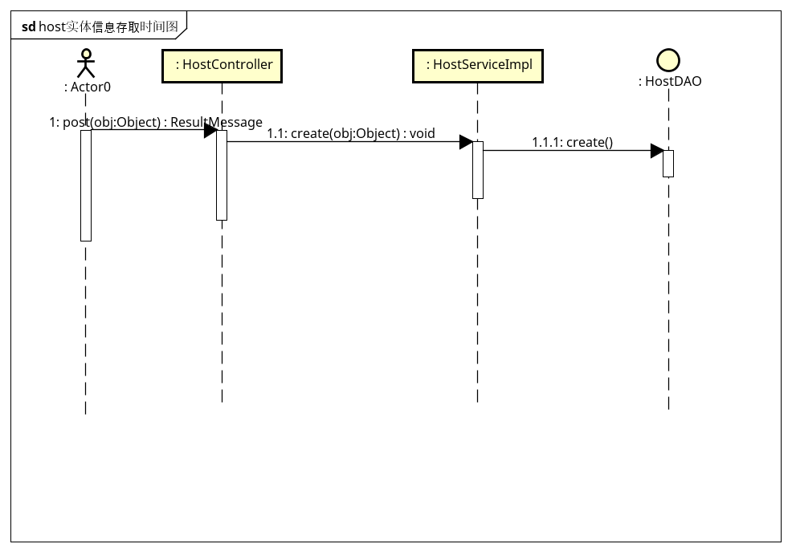
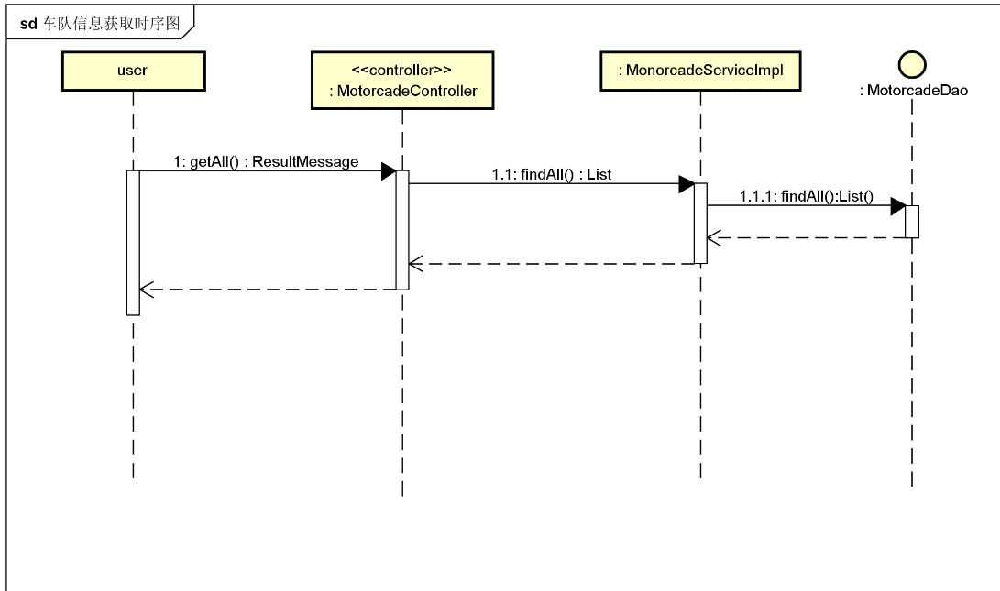

# 系统设计说明书

## 概述
项目背景知识，针对的阅读对象、编写文档的目的。
## 技术架构
  从宏观上设计架构体系，包括主机分布、网络拓扑、与外部系统如何对接；系统划分为几个构件、构件之间的关系、外部接口等（此处可用UML部署图）
  
   
  说明：
  1. 最大方框为系统边界;软件组件大致分pc客户端上运行的前端页面，手机上运行的app前端程序，应用服务器上运行的安全门户、负责实时监控、告警展示与分析的服务端程序，以及负责接收车载设备上传数据的服务端接口实现。
 2.  硬件，网络拓扑建议方案，最前端设一负载均衡服务器，可 以用nginx来实现;从客户端、车载设备到负载均衡器的访问走的是互联网，要求尽可能用加密传输，协议为https,接口设计符合RESTful风格。负载均衡到应用服务器间是局域网。协议可采用http或https;应用服务器到数据库类服务器之间是局域网环境，采用jdbc通讯协议，到redis之间采用的是jedis驱动通讯协议连接。其中redis服务器专门用来进行应用中的数据访问缓存服务器。
 3. 另外，建议应用服务器至少两台，数据库服务器至少两台，
  保证高可用性。其中应用服务器可以根据访问负载的大小弹性升级，即横向扩展，为了部署运维方便 ，可以采用docker容器及管理工具进行弹性扩容。
  
## 技术选型
### 开发框架说明
   
* 前端框架采用 epm-ui前端框架，epm-ui是react框架的变种，是东方国信开发的
* 后端框架完成基本业务部分主要采用springboot框架实现各业务web服务接口，基中springboot集成了hibernate来完成数据库操作，采用spring-jpa来对接hibernate.
* 针对车载设备上传数据这一块，则暂定用go语言及对应的web框架开发，以实现高并发的需要
* 整个系统的登录、权限、日志、门户等基础功能采用公司“安全&门户”产品实现。
* 手机端采用React Native技术框架开发，方便适用于iphone,andorid等多种手机端。

###  设计模式说明
   （自已的代码用什么的设计模式，理由）
   由于采用的是springboot框架开发的，所以主要编程模式为MVC,所以设计时主要以实体类、控制器、DAO类，Service类为主，辅助一些普通 POJO类
## 非功能性设计
（ 针对需求文档中的具体要求，进行针对性的设计）
### 性能设计 
（如并发性设计、缓存设计等、集群）
### 安全性设计 
（采用什么安全框架与技术，加密算法、安全协议实现等）
### 可靠性设计 
（如何实现容错、故障恢复）
### 扩展性设计 
（如何弹性扩容、二次开发等）
## 接口设计
（构件之间的接口、 与外部系统的接口,此处可辅助以部署图、构件图）

### 外部接口设计
目前，可知的外部接口就是“车载设备”与系统之间的数据上传接口;此类接口由设备提供方决定，我们需要实现此接口。（目前此接口尚未拿到，等拿到后放在这里）

###  内部接口设计

**url格式设计**
   程序内部之间的接口采用RESTful风格的接口。
   所有接口描述请采用url地址方式，输入可采用常规参数;输出采用json格式。
   其中URL模式遵循以下规范：
   
  1.  统一前缀，采用 http://IP:PORT/APP/api/v1.0/...样式
  2. IP为服务器替换为实际ip地址或域名，PORT替 换为为WEB服务器端口号;APP替换为实际的应用名称;
 3. api/v1.0/是通用路径前缀;表示此url为应用开发接口，v1.0表示为此接口的版本号。
 
 以下所有模块的接口说明中，只写相对于上述前缀的地址，不再重复。
 key
 **返回值json格式设计**
 
 返回值统一定义：
 \{"success" : "true","msg" : "操作成功","result":{...}}
 即不管后台进行什么操作，都要有sucess,msg,result,即成功标识，提示信息，结果对象，结果对象根据情况可以是空的．
 为方便起见，下述所有ｒｅｓｔ接口返回值描述，将直接写result部分．实际开发时，controller方法都返回ResultMessage对象来实现．
 因后台异常失败的，需要将友好的异常信息放在msg中，如果是查询类的，将结果包装成合适的对象放入result.
 
 **分页接口设计**
分页查询的接口，除业务查询条件外，统一增加order,sort,page,rows参数
分别代表排序方式(asc /desc)  , 排序字段，页号，每页行数。
分页返回的结果对象，增加total ,rows属性，total表示总条数，rows表示当前页行数据集合。
 其它不变。
#### 系统配置部分的接口

|接口名称|url|输入|输出|方法|备注|
|----|----|----|----|----|----|
|系统参数添加| /sysconfig | pkey,pvalue,pdescr |\{"success" : "true","msg" : "操作成功","result":{...}}| POST| pkey表示参数名，pvalue为参数值，pdescr为说明|
|系统参数删除| /sysconfig/\{id}| -  |\{"success" : "true","msg" : "操作成功","result":{...}}| DELETE| pkey表示参数名，pvalue为参数值，pdescr为说明|
|系统参数批量删除| /sysconfig | [33，44,55] |\{"success" : "true","msg" : "操作成功","result":{...}}| DELETE| 输入参数为 id 数组|
|系统参数修改| /sysconfig | id,pkey,pvalue,pdescr |\{"success" : "true","msg" : "操作成功","result":{...}}| PUT| id为标识，pkey表示参数名，pvalue为参数值，pdescr为说明|
|系统参数分页多条件查询| /sysconfig| pkey,pdescr |\{"success" : "true","msg" : "操作成功","result":{"total":2,"rows":[{"pkey":"test","pvalue":"test","pdescr":"test"},{"pkey":"test1","pvalue":"test2"},"pdescr":"test3"]}}| GET| key表示参数名，value为参数值，descr为说明|
|系统参数单条查询| /sysconfig/\{id}| - |\{"success" : "true","msg" : "操作成功","result":{"pkey":"test","pvalue":"test","pdescr":"test"}}| GET| key表示参数名，value为参数值，descr为说明|
|系统参数列出全部| /sysconfig/all| - |\{"success" : "true","msg" : "操作成功","result":[{"pkey":"test","pvalue":"test","pdescr":"test"}}]| GET| key表示参数名，value为参数值，descr为说明|
|系统参数批量删除 | /sysconfig| ids |\{"success" : "true","msg" : "操作成功","result":null| DELETE| key表示参数名，value为参数值，descr为说明,ids 为要删除 的id列表，用逗 号分开的字符串|

#### 平台监控部分接口

* 主机性能监控接口

|接口名称|url|输入|输出|方法|备注|
|----|----|----|----|----|----|
|主机内存监控接口| /host/\{id\} /status/mem | -  |\{"max" : 1024,"min" :  0, "used" : 256\}| GET| mem指内存，max为最大， min为最小，used为使用了多少，id表示主机的编号|
|主机cpu监控接口| /host/\{id\} status/cpu | -  |\{"max" : 1024,"min" :  0, "used" : 256\}| GET| cpu指中央处理器，max为最大， min为最小，used为使用了多少，id表示主机的编号|
|主机disk监控接口| /host/\{id\} /status/disk | -  |\{"max" : 1024,"min" :  0, "used" : 256\}| GET| disk指磁盘空间，max为最大， min为最小，used为使用了多少，id表示主机的编号|
|主机net监控接口| /host/\{id\} /status/net | -  |\{"max" : 1024,"min" :  0, "Tx" : 256,"Rx": 234 \}| GET| net指网络带宽，max为最大， min为最小，rx为接收流量，Tx为发送流量，id表示主机的编号|
|主机process监控接口| /host//\{id\}/status/process  | ord  |[\{"pid" : 1399,"name" :  "java", "cpu" : 20,"mem" : 21 \},\{"pid" : 1398,"name" :  "firfox", "cpu" : 30,"mem" : 31 \}]| GET|id表示主机的编号,pid 表示进程号，name 表示进程名 ，cpu表示cpu占用百分比,mem为内存占比，数组元素从占资源大的到小排序，参数ord为排序方式，可以按cpu与 mem来排,注意每次只返回前10名|

 

* tomcat监控接口

|接口名称|url|输入|输出|方法|备注|
|----|----|----|----|----|----|
|tomcat内存监控接口|  /tomcat/\{id\} /status/mem | -  |\{"max" : 1024,"min" :  0, "used" : 256\}|  GET|mem指内存，max为最大， min为最小，used为使用了多少，id表示tomcat的编号|
|tomcat内存池监控接口|  /tomcat/\{id\} /status/mempool | -  |[\{"name" : "PS Eden Space","min" :  0, "max" : 100,"used" : 90\},{"name" : "PS Old Gen","min" :  0, "max" : 100,"used" : 90\}]| GET| mempool指内存池，，id表示tomcat的编号,PS Eden Space、PS Old Gen、PS Survivor Space、Code Cache、Compressed Class Space、Metaspace等为内存池中不同内存区域的名称，init代表初始化，max表示最大，used表示已用的大小|
|tomcat线程池监控接口|  /tomcat/\{id\}/status/threadpool  | -  |[\{"name":"http-bio-8082","max" : 200,"used" :  12 \},\{"name":"ajp-bio-8039","max" : 200,"used" :  0 \}]|GET|  name为线程池名字，对应一个connetor，max为线程池的最大线数， used是指已经使用的线程数|
|tomcat慢请求线程top10监控接口|  /tomcat/\{id\}/status/slowthread  | -  |[\{"processTime" :  75,"requesturl" : "/index.jsp"\},{"processTime" :  30,"requesturl" : "/pool.jsp"\}]|GET| processTime为处理此请求花的时间，单位是ms,requesturl为请求地址，id表示tomcat的编号，|

 

* 应用监控接口

|接口名称|url|输入|输出|方法|备注|
|----|----|----|----|----|----|
|应用状态监控接口| /app/{id\}/status|- |{"name" : "cas","path" : "/cas","version" : "1.0" ," desc" : "单点登录系统","status" : "run","session" : "5"\} |GET| id为app的编号,app表示是应用，status表示状态，name表示应用名称，path表示是应用的路径，version表示版本号，desc表示功能描述，status表示运行状态，状态有三：run、stop、error，分表指正常运行，停止，异常;session代表当前有多少个会话连接这个应用|
|应用状态静态分析接口| /app/{id\}/statusanalysis|- |{"run" : 10,"stop" : 10,"error" : 0\} | GET| id为app的编号,app表示是应用，statusanalysis表示运行状态分析，状态有三：run、stop、error，分表指正常运行，停止，异常;|
|应用状态静态分析接口| /app/{id\}/sessionanalysis|- |[10,9,8,7,....20,24...9,8,7]| GET| id为app的编号,app表示是应用，sessionanalysis表示会话分析，数组中按时间序列排列，数据项为向前推昨天24小时内的数据|

* 节点注册管理功能接口

|接口名称|url|输入|输出|方法|备注|
|----|----|----|----|----|----|
|主机节点注册接口|/host |ip,name,port,user,password | \{"success" : "true","msg" : "操作成功"} |POST |  |
|主机节点删除接口|/host/\{id} | -|  \{"success" : "true","msg" : "操作成功"} |DELETE |  |
|主机节点修改接口|/host  |id,ip,name,port,user,password | \{"success" : "true","msg" : "操作成功"} |PUT |  |
|tomcat节点注册接口|/tomcat| name,path,port,user,password,host.id|  \{"success" : "true","msg" : "操作成功"} |POST | name为tomcat名称，host.id为所以的主机节点的id，path指安装的路径、port为管理端口号，user为管理账号,password为管理口令 |
|tomcat节点删除接口|/tomcat/\{id} | -|  \{"success" : "true","msg" : "操作成功"} |DELETE |  |
|tomcat节点修改接口|/tomcat |id,path,port,user,password,host.id | \{"success" : "true","msg" : "操作成功"} |PUT | 同上 |
|应用节点注册接口|/app| path,name,version,descr,tomcat.id |  \{"success" : "true","msg" : "操作成功"} |POST | tomcat.id为app所在的tomcat的id， path为访问路径，name为应用名称，version为版本号,descr为说明信息 |
|应用节点删除接口|/app/\{id} | -|  \{"success" : "true","msg" : "操作成功"} |DELETE |  |
|应用节点修改接口|/app  |id,path,name,version,descr,tomcat.id | \{"success" : "true","msg" : "操作成功"} |PUT |path为访问路径，name为应用名称，version为版本号,descr为说明信息  |
|主机节点列表查询所有|/host/all  |- | \{"success" : "true","msg" : "操作成功"} "result":[{"ip":"127.0.0.1","port":22,"user":"root","password":"root","name":"host123"}]|GET|ip为主机ip地址，port为ssh服务的端口号，user为管理账号，password为密码，name为主机名称  |
|根据主机id列表查询所有的tomcat|/tomcat  | hostId | \{"success" : "true","msg" : "操作成功"} "result":[{"port":8080,"user":"root","password":"root","name":"host123"}]|GET|ip为主机port为tomcat的端口号，user为管理账号，password为密码，name为主机名称,hostid为主机的id  |
|根据tomcat id列表查询所有的app|/app |tomcatId | \{"success" : "true","msg" : "操作成功"} "result":[{"port":8080,"user":"root","password":"root","name":"host123"}]|GET|ip为主机ip地址，port为ssh服务的端口号，user为管理账号，password为密码，name为主机名称,hostid为主机的id  |

* 节点启停功能接口

|接口名称|url|输入|输出|方法|备注|
|----|----|----|----|----|----|
|tomcat停止接口| /tomcat/\{id}/stop|- |\{"success" : "true","msg" : "操作成功"} |POST |success 为成功标志，值为true或false,msg为提示信息 |
|tomcat启动接口| /tomcat/\{id}/start|- |\{"success" : "true","msg" : "操作成功"} |POST | |
|tomcat节点启动接口| /tomcat/\{id}/restart|- |\{"success" : "true","msg" : "操作成功"} |POST | |
|app停止| /app/\{id}/stop|- |\{"success" : "true","msg" : "操作成功"} |POST |success 为成功标志，值为true或false,msg为提示信息 |
|app启动接口| /app/\{id}/start|- |\{"success" : "true","msg" : "操作成功"} |POST | |
|app节点重启启动接口| /app/\{id}/restart|- |\{"success" : "true","msg" : "操作成功"} |POST | |
|host节点重启动接口| /host/\{id}/restart|- |\{"success" : "true","msg" : "操作成功"} |POST | |

* 节点健康状态检查接口

|接口名称|url|输入|输出|方法|备注|
|----|----|----|----|----|----|
|host健康状态检查接口| /host/\{id}/health|- |\{"success" : "true","msg" : "操作成功","result":runing\|stopping} |GET |success 为成功标志，值为true或false,msg为提示信息,result:running 表示正常运行，stopping表示已关闭|
|tomcat健康状态检查接口| /tomcat/\{id}/health|- |\{"success" : "true","msg" : "操作成功","result":runing\|stopping} |GET |success 为成功标志，值为true或false,msg为提示信息,result:running 表示正常运行，stopping表示已关闭|
|app健康状态检查接口| /app/\{id}/health|- |\{"success" : "true","msg" : "操作成功","result":runing|stopping\|error} |GET |success 为成功标志，值为true或false,msg为提示信息,result:running 表示正常运行，stopping表示已关闭,error表示在运行但不正常|

#### 基础信息管理部分接口

* 码表类型接口

|接口名称|url|输入|输出|方法|备注|
|----|----|----|----|----|----|
|地域类型查询接口| /areaType |  |{"success":"true","msg":"操作成功","result":{[{"id":"", "name":""},{...}]}|GET |  id:地域id，name：地域名称 |
|运营范围类型查询接口| /businessType |  |{"success":"true","msg":"操作成功","result":{[{"id":"", "name":""},{...}]}|GET |  id:运营范围id，name：运营范围名称 |
|颜色类型查询接口| /colorType |  |{"success":"true","msg":"操作成功","result":{[{"id":"", "name":""},{...}]}|GET |  id:颜色id，name：颜色名称 |
|终端状态查询接口| /deviceStatus |  |{"success":"true","msg":"操作成功","result":{[{"id":"", "name":""},{...}]}|GET |  id:终端状态id，name：终端状态名称 |
|终端类型查询接口| /deviceType |  |{"success":"true","msg":"操作成功","result":{[{"id":"", "name":""},{...}]}|GET |  id:终端类型id，name：终端类型名称 |
|准驾车型查询接口| /drivingType |  |{"success":"true","msg":"操作成功","result":{[{"id":"", "name":""},{...}]}|GET |  id:准驾车型id，name：准驾车型名称 |
|行业类型查询接口| /industryType |  |{"success":"true","msg":"操作成功","result":{[{"id":"", "name":""},{...}]}|GET |  id:行业id，name：行业名称 |
|运行状态查询接口| /runningStatus |  |{"success":"true","msg":"操作成功","result":{[{"id":"", "name":""},{...}]}|GET |  id:运行状态id，name：运行状态名称 |
|运输公司类型查询接口| /transCompanyType |  |{"success":"true","msg":"操作成功","result":{[{"id":"", "transCompanyTypeName":""},{...}]}|GET |  id:运输公司类型id，name：运输公司类型名称 |
|车辆类型查询接口| /vehicleType |  |{"success":"true","msg":"操作成功","result":{[{"id":"", "name":""},{...}]}|GET |  id:车辆类型id，name：车辆类型名称 |

* 运输公司信息新增接口

|接口名称|url|输入|输出|方法|备注|
|----|----|----|----|----|----|
|运输公司信息新增接口|/transFirm |transCompanyName，transType.id，superDepartment.id，terminalCompany.id，businessLicense，businessLicenseNo，businessType.id，area.id，contact，tel，note，insuranceCompany.id| {"success":"true","msg":"新增成功"}| POST| success 为成功标志，值为true或false,msg为提示信息;transCompanyName为运输公司名称，transType为运输公司类型，superDepartment为上级部门，terminalCompany为所属业户，businessLicense为经营许可证字，businessLicenseNo为经营许可证号，businessType为经营范围，area为所属地区(数据格式参考'地域')，contact为联系人，tel为联系人电话, note为备注，insuranceCompany为保险公司(数据格式参考'保险公司')|
|运输公司信息修改接口|/transFirm |id,transCompanyName，transType.id，superDepartment.id，terminalCompany.id，businessLicense，businessLicenseNo，businessType.id，area.id，contact，tel，note，insuranceCompany.id| {"success":"true","msg":"操作成功"}| PUT | success 为成功标志，值为true或false,msg为提示信息;id为运输公司ID其余同上|
|运输公司信息单条查询接口|/transFirm/{id} | - |{"success":"true","msg":"操作成功","result":{"id":1,"transCompanyName":""， "transType":{"id":"","transCompanyTypeName":""}，"superDepartment":""， "terminalCompany":""， "businessLicense":""， "businessLicenseNo":""， "businessType":{"id":"","name":""}， "area":{}， "contact":""， "tel":""， "note":"" ,  "insuranceCompany":{}}}| GET |该接口为根据运输公司查询详细信息；同上|
|运输公司信息模糊查询接口|/transFirm |transCompanyName,area.id, transType.id,businessType.id, page, row, order, sort |{"success":"true","msg":"操作成功","result":{"id":1, "transCompanyName":""， "transType":""， "superDepartment":""， "terminalCompany":""， "businessLicense":""， "businessLicenseNo":""， "businessType":""， "area":""， "contact":""， "tel":""， "note":"" ,  "insuranceCompany":""}，{...} | GET | 该接口为搜索查询接口；同上 |
|运输公司信息管理"树"查询接口gettree| /transFirm/getTree | -   |{[{"date":{"tid":"1"},"name":"北京运输公司","isLeaf":false},{...}]}|GET |  tid:运输公司id，name：运输公司名称，isleaf：当该运输公司无下层公司为true，反之为false|
|运输公司信息管理"树"查询接口tid| /transFirm/getTree/{tid} | -  |{[{"date":{"tid":"1"},"name":"北京运输公司","isLeaf":false},{...}]}|GET |  同上|
|运输公司信息删除接口|/transFirm/{id}| - |{"success":"true","msg":"删除成功！"}| delete| id 为运输公司id;success 为成功标志，值为true或false,msg为提示信息|
|运输公司信息批量删除接口|/transFirm| ids |{"success":"true","msg":"删除成功！"}| delete| ids ids 为要删除 的id列表，用逗 号分开的字符串|
|运输公司信息导出接口| /transFirm/export |-  |\{"success" : "true","msg" : "操作成功"} |POST |  |

* 车队信息接口

|接口名称|url|输入|输出|方法|备注|
|----|----|----|----|----|----|
|车队信息新增接口|/motorcade |motorcadeName, parentId, terminalCompany, businessLicense, businessLicenseNo, businessType, area, contact, tel, note, insuranceCompanyId | {"success":"true","msg":"操作成功"}| POST| success 为成功标志，值为true或false,msg为提示信息;motorcadeName为车队名称，parentId为上级部门id，terminalCompany为所属业户，businessLicense为经营许可证字，businessLicenseNo为经营许可证号，businessType为经营范围，area为所属地区，contact为联系人，tel为联系人电话, note为备注，insuranceCompanyId为保险公司Id
|车队信息更新接口|/motorcade | id,motorcadeName, parentId, terminalCompany, businessLicense, businessLicenseNo, businessType, area, contact, tel, note, insuranceCompanyId | {"success":"true","msg":"操作成功“}| PUT| success 为成功标志，值为true或false,msg为提示信息;motorcadeId为车队Id， motorcadeName为车队名称，parentId为上级部门id，terminalCompany为所属业户，businessLicense为经营许可证字，businessLicenseNo为经营许可证号，businessType为经营范围，area为所属地区，contact为联系人，tel为联系人电话, note为备注，insuranceCompanyId为保险公司Id
|车队信息单条查询接口|/motorcade/{id} | - |{"success":"true","msg":"操作成功","result":{"id":1, "motorcadeName":"顺丰车队", "parent":{}, "terminalCompany":"null", "businessLicense":"ISO-90001", "businessLicenseNo":"8888", "businessType":"货运", "area":"北京", "contact":"田七", "tel":"13888888888", "note":"附加信息123", "insuranceCompanyId":"777"}}| GET|
|车队信息模糊查询接口|/motorcade |motorcadeName，area，parentId, page,row, order,sort |{"success":"true","msg":"操作成功","result":{"id":1, "motorcadeName":"龙门镖局", "parentId":"111", "terminalCompany":"null", "businessLicense":"ISO-90001", "businessLicenseNo":"8888", "businessType":"货运", "area":"北京", "contact":"田七", "tel":"13888888888", "note":"附加信息123", "insuranceCompany":"人保"}}| GET|
|车队信息管理"树"查询接口gettree| /motorcade/getTree | -   |{[{"date":{"tid":"1"},"name":"北京车队","isLeaf":false},{...}]}|GET |  tid:车队id，name：车队名称，isleaf：当该车队无下层车队为true，反之为false|
|车队信息管理"树"查询接口tid| /motorcade/getTree/{tid} | -  |{[{"date":{"tid":"1"},"name":"北京车队","isLeaf":false},{...}]}|GET |  同上|
|车队信息删除接口|/motorcade/{id}| - | {"success":"true","msg":"删除成功！"} | DELETE|motorcadeId 为车队id;success 为成功标志，值为true或false,msg为提示信息
|车队信息导出接口| /motorcade/export |-  |\{"success" : "true","msg" : "操作成功"} |POST |  |

* 地域信息管理接口

|接口名称|url|输入|输出|方法|备注|
|----|----|----|----|----|----|
|地域信息模糊查询接口| /area | areaName，type.id, fatherArea.id, page,row,  order,sort   |{"success":"true","msg":"操作成功","result":[{"id":"3","areaName" : "东城区","number" :  "010101", "type" :{"id":"2","name":"市"}, "fatherArea" : {...}},{...}]}|GET |  areaName指地域名称， number指编号，type指类型，fatherArea指父级地域|
|地域信息单条查询接口| /area/{id} | -   |{"success":"true","msg":"操作成功","result":{"id":"3","areaName" : "东城区","number" :  "010101", "type" : {"id":"2","name":"市"}, "fatherArea" : {...}}}|GET |  areaName指地域名称， number指编号，type指类型，fatherArea指父级地域|
|地域信息管理"树"查询接口gettree| /area/getTree | -   |{[{"date":{"tid":"1"},"name":"北京","isLeaf":false},{...}]}|GET |  areaName指地域名称， number指编号，type指类型，fatherArea指父级地域|
|地域信息管理"树"查询接口tid| /area/getTree/{tid} | -  |{[{"date":{"tid":"1"},"name":"北京","isLeaf":false},{...}]}|GET |  areaName指地域名称， number指编号，type指类型，fatherArea指父级地域|
|地域信息添加接口| /area | areaName,number,type.id,fatherArea.id  |\{"success" : "true","msg" : "操作成功"} |POST |  add指添加，areaName指地域名称， number指编号，type指类型，fatherArea指父级地域|
|地域信息修改接口| /area | id,areaName,number,type.id,fatherArea.id  |\{"success" : "true","msg" : "操作成功"} | PUT |  edit指修改，areaName指地域名称， number指编号，type指类型，fatherArea指父级地域|
|地域信息删除接口| /area/{id} |- |\{"success" : "true","msg" : "操作成功"} |DELETE |  delete指删除 |
|地域信息批量删除接口| /area |ids |\{"success" : "true","msg" : "操作成功"} |DELETE |  delete指删除，areaName指地域名称， number指编号，type指类型，fatherArea指父级地域,ids 为要删除 的id列表，用逗 号分开的字符串|
|地域信息导出接口| /area/export |-  |\{"success" : "true","msg" : "操作成功"} |POST |  |
|地域信息导入接口| /area/import |-  |\{"success" : "true","msg" : "操作成功"} |POST |  |

* 保险公司信息接口

|接口名称|url|输入|输出|方法|备注|
|----|----|----|----|----|----|
|保险公司信息模糊查询接口| /insuranceCompany | parent.id, name, page,row,  order,sort   |{"success":"true","msg":"操作成功","result":{"id":"","name":"","parentName":"", "location" : "", "tel" : ""}}|GET |  id指保险公司id，name指保险公司名称， parentName指上级部门名称， parent.id指上级部门id，location指地址 ， tel指电话|
|保险公司信息单条查询接口| /insuranceCompany/{id} | -   |{"success":"true","msg":"操作成功","result":{"id":"","name":"","parentName":"", "location" : "", "tel" : ""}}|GET |  同上 |
|保险公司信息添加接口| /insuranceCompany | name,parent.id,location，tel  |\{"success" : "true","msg" : "操作成功"} |POST |  同上 |
|保险公司信息修改接口| /insuranceCompany | id,name, parent.id,location，tel  |\{"success" : "true","msg" : "操作成功"} | PUT |  同上 |
|保险公司信息删除接口| /insuranceCompany/{id} |- |\{"success" : "true","msg" : "操作成功"} |DELETE |  delete指删除，id指保险公司id|
|保险公司信息批量删除接口| /insuranceCompany |ids |\{"success":"true","msg":"操作成功"} |DELETE |  delete指删除，ids为要删除的id列表，用逗号分开的字符串|
|保险公司信息导出接口| /insuranceCompany/export |-  |\{"success" : "true","msg" : "操作成功"} |POST |  |
|保险公司信息导入接口| /insuranceCompany/import |-  |\{"success" : "true","msg" : "操作成功"} |POST |  |

* 驾驶人信息管理相关接口

|接口名称|url|输入|输出|方法|备注|
|----|----|----|----|----|----|
|驾驶人信息查询接口| /driver | plateNo, name，idCardNo，motorcade.id, page,row,  order,sort|{"success":true, "msg":"驾驶员信息查询成功", "result":{[{"id":1, "name":"吴迪", "idCardNo":"45464", "gender":"44", "headUrl":"asass", "vehicle":{...}(详见车辆信息格式), "list":[{...(详见车辆信息格式)},{}], "tel":null, "drivingYear":12.0, "supercargoName":null, "birth":"2018-02-28", "claimFrequence":1254, "licenseStatus":"45", "drivingType":{"id":1, "name":"测试"}, "firstDate":"2018-01-15", "validDate":null, "driversLicenseNumber":"5645", "fileNo":"4545", "qualificationCertificateName":"454", "qualificationCertificateType":"445", "qualificationCertificateNo":"4545", "certifyingAuthority":"45445", "certifyingTime":"2018-02-13", "expirationTime":"2018-02-06", "regulator":null, "regulatorTel":null}},{...}]} | GET |  id:驾驶员自增id, name:驾驶员名称, idCardNo:身份证号, gender:性别, headUrl:头像地址, vehicle:主驾车辆, list:绑定车辆集合, motorcade:所属车队， tel:联系电话, drivingYear:驾龄, supercargoName:押运员姓名, birth:出生日期, claimFrequence:出险次数, licenseStatus:认证状态（1：已认证，0：未认证）, drivingType:准驾车型, firstDate:初次领证日期, validDate:有效日期, driversLicenseNumber:驾驶证号, fileNo:档案编号, qualificationCertificateName:从业资格证, qualificationCertificateType:从业资格证类别, qualificationCertificateNo:证件编号, certifyingAuthority:发证机构, certifyingTime:发证日期, expirationTime:过期时间, regulator:监督机构, regulatorTel:监督电话|
|驾驶人信息添加接口| /driver | name, idCardNo, motorcade.id, gender, headUrl, vehicle.id, list:绑定车辆集合, tel, drivingYear, supercargoName,birth,claimFrequence,licenseStatus,drivingType.id, firstDate, validDate,driversLicenseNumber, fileNo, qualificationCertificateName,qualificationCertificateType, qualificationCertificateNo, certifyingAuthority, certifyingTime, expirationTime, regulator, regulatorTel  |{"success" : "true","msg" : "操作成功"} |POST |  同上|
|驾驶人信息修改接口| /driver | id,name, idCardNo, motorcade.id, gender, headUrl, vehicle.id, list:绑定车辆集合, tel, drivingYear, supercargoName,birth,claimFrequence,licenseStatus,drivingType.id, firstDate, validDate,driversLicenseNumber, fileNo, qualificationCertificateName,qualificationCertificateType, qualificationCertificateNo, certifyingAuthority, certifyingTime, expirationTime, regulator, regulatorTel  |\{"success" : "true","msg" : "操作成功"} | PUT |  同上|
|驾驶人信息删除接口| /driver/{id} |- |\{"success" : "true","msg" : "操作成功"} |DELETE |  delete指删除，id指驾驶人id|
|驾驶人信息批量删除接口| /driver |ids |\{"success":"true","msg":"操作成功"} |DELETE |  delete指删除，ids为要删除的id列表，用逗号分开的字符串|
|驾驶人信息导出接口| /driver/export |-  |\{"success" : "true","msg" : "操作成功"} |POST |  export指导出|

* 车辆信息管理接口

|接口名称|url|输入|输出|方法|备注|
|----|----|----|----|----|----|
|车辆信息模糊查询接口| /vehicle | plateNo, motorcade.id， deviceNo， driver.id, page,row,  order,sort   |{"success":"true","msg":"操作成功","result":{[{"id":"", "plateNo":"", "deviceNo":"", "motorcade":{}, "industryType":{  "id":"",  "name":"" }, "color":{  "id":"",  "name":"" }, "carArea":{}, "device":{}, "engineNo":"", "deviceStatus":{  "id":"",  "name":"" }, "installTime":"", "netInTime":"", "vehicleType":{  "id":"",  "name":"" }, "terminalCompany":{  "id":"",  "terminalCompanyName":"" }, "runningStatus":{  "id":"",  "name":"" }, "startTime":"", "endTime":"", "brand":"", "model":"", "useCharacter":"", "vin":"", "issueDate":"", "validDate":"", "tractionMass":"", "approvedPassengersCapacity":"", "grossMass":"", "unladenMass":"", "approvedLoad":"", "insuranceCompany":{}, "saliNo":"", "commerceInsuranceNo":"", "insuranceStartTime":"", "insuranceEndTime":""},{...}]}|GET |  "id":车辆信息自增id, "driver":主驾驶员， "plateNo":车牌号码, "deviceNo":终端卡号, "motorcade":所属车队, "industryType":行业类型, "color":颜色, "carArea":车籍地(数据格式参考'地域'), "device":终端(数据格式参考'终端'), "engineNo":发动机号, "deviceStatus":设备状态, "installTime":安装时间, "netInTime":入网时间, "vehicleType":车辆类型, "terminalCompany":所属业户, "runningStatus":运行状态, "startTime":服务开始时间, "endTime":服务结束时间, "brand":品牌, "model":型号, "useCharacter":使用性质, "vin":车辆识别代号, "issueDate":发证日期, "validDate":失效日期, "tractionMass":准牵引总质量, "approvedPassengersCapacity":核定载人数, "grossMass":总质量, "unladenMass":整备质量, "approvedLoad":核定载质量, "insuranceCompany":保险公司(数据格式参考'保险公司'), "saliNo":加强险保单号, "commerceInsuranceNo":商业险保单号, "insuranceStartTime":投保日期, "insuranceEndTime":失效日期|
|车辆信息单条查询接口| /vehicle/{id} | -   |{"success":"true","msg":"操作成功","result":{"id":"", "plateNo":"", "deviceNo":"", "motorcade":{}, "industryType":{  "id":"",  "name":"" }, "color":{  "id":"",  "name":"" }, "carArea":{}, "device":{}, "engineNo":"", "deviceStatus":{  "id":"",  "name":"" }, "installTime":"", "netInTime":"", "vehicleType":{  "id":"",  "name":"" }, "terminalCompany":{  "id":"",  "terminalCompanyName":"" }, "runningStatus":{  "id":"",  "name":"" }, "startTime":"", "endTime":"", "brand":"", "model":"", "useCharacter":"", "vin":"", "issueDate":"", "validDate":"", "tractionMass":"", "approvedPassengersCapacity":"", "grossMass":"", "unladenMass":"", "approvedLoad":"", "insuranceCompany":{}, "saliNo":"", "commerceInsuranceNo":"", "insuranceStartTime":"", "insuranceEndTime":""}}|GET |  |
|车辆信息添加接口| /vehicle | plateNo, deviceNo, driver.id, motorcade.id, industryType.id, color.id, carArea.id, device.id, engineNo, deviceStatus.id, installTime, netInTime, vehicleType.id, terminalCompany.id, runningStatus.id, startTime, endTime, brand, model, useCharacter, vin, issueDate, validDate, tractionMass, approvedPassengersCapacity, grossMass, unladenMass, approvedLoad, insuranceCompany.id, saliNo, commerceInsuranceNo, insuranceStartTime, insuranceEndTime |\{"success":"true","msg":"操作成功"} |POST |  |
|车辆信息修改接口| /vehicle | id, plateNo, deviceNo, motorcade.id, industryType.id, color.id, carArea.id, device.id, engineNo, deviceStatus.id, installTime, netInTime, vehicleType.id, terminalCompany.id, runningStatus.id, startTime, endTime, brand, model, useCharacter, vin, issueDate, validDate, tractionMass, approvedPassengersCapacity, grossMass, unladenMass, approvedLoad, insuranceCompany.id, saliNo, commerceInsuranceNo, insuranceStartTime, insuranceEndTime |\{"success":"true","msg":"操作成功"} | PUT |  |
|车辆信息删除接口| /vehicle/{id} |- |\{"success":"true","msg":"操作成功"} |DELETE |  |
|车辆信息批量删除接口| /vehicle |ids |\{"success":"true","msg":"操作成功"} |DELETE |  delete指删除，ids为要删除的id列表，用逗号分开的字符串|
|车辆信息导出接口| /vehicle/export |-  |\{"success":"true","msg":"操作成功"} |POST |  |

* 采集设备信息管理接口

|接口名称|url|输入|输出|方法|备注|
|----|----|----|----|----|----|
|采集设备信息模糊查询接口| /device | deviceId, deviceType.id, deviceStatus, cameraStatus.id, executeStatus, isCalibrat   |{"success":"true","msg":"操作成功","result":[{"id":"1", "deviceId":"123254682", "deviceType":{"id":"1","name":"gat"}, "deviceStatus":{"id":"1","name":"已启用"}, "installDate":"2017-2-02-11", "softwareVersionNumber":"106", "hardwareVersionNumber":"102", "factoryNumber":"2232", "installer":"安装工", "updateInterval":"10", "note":"备注", "versionName":"v2.3.003.020", "vehicle":{"id":"1",...详见车辆数据格式}, "cameraStatus":{"id":"1","name":"正常"}, "sd":"1", "totalSpace":"4G", "freeSpace":"3G", "latestExecutionTime":"2017-2-02-11", "latestIssueTime":"2017-2-02-11", "executeStatus":"1", "isCalibrate":"1",handOut":"下发人"},{...}]}|GET |  id:自增id, deviceId:设备唯一id, deviceType:终端类型, deviceStatus:终端当前状态, installDate:安装时间, softwareVersionNumber:软件版本号, hardwareVersionNumber:硬件版本号, factoryNumber:出厂号, installer:安装工, updateInterval:位置上传间隔, note:备注, versionName:版本名称, vehicle:绑定车辆, cameraStatus:摄像机状态, sd:是否有SD(0:没有；1：有）, totalSpace:总空间, freeSpace:剩余空间, latestExecutionTime:最近执行时间, latestIssueTime:最近下发时间, executeStatus:执行状态（0：未执行；1：已执行）, isCalibrate:是否校准：0：未校准；1：已校准,handOut:下发人|
|采集设备信息单条查询接口| /device/{id} | -   |{"success":"true","msg":"操作成功","result":{同上，单条}|GET |  同上|
|采集设备信息添加接口| /device | deviceId, deviceType.id, deviceStatus.id, installDate, softwareVersionNumber, hardwareVersionNumber, factoryNumber, installer, updateInterval, note  |\{"success" : "true","msg" : "操作成功"} |POST |  同上|
|采集设备信息修改接口| /device | id, deviceId, deviceType.id, deviceStatus.id, installDate, softwareVersionNumber, hardwareVersionNumber, factoryNumber, installer, updateInterval, note |\{"success" : "true","msg" : "操作成功"} | PUT | 同上|
|采集设备信息删除接口| /device/{id} |- |\{"success" : "true","msg" : "操作成功"} |DELETE |  delete指删除 |
|采集设备信息批量删除接口| /device |ids |\{"success" : "true","msg" : "操作成功"} |DELETE |  ids 为要删除 的id列表，用逗 号分开的字符串|
|采集设备信息导出接口| /device/export |-  |\{"success" : "true","msg" : "操作成功"} |POST |  |

### 用户接口设计
 (对应于每一个用例设计精确的用户界面，注意此时不是示意图了，是最终的交互方式与视觉效果，视觉效果可能由美工UI设计师用其它工具设计、此处截图，可附件设计稿)

 
#### 平台监控部分
* 平台监控-tomcat添加(标注)
 .jpg)

* 平台监控-tomcat性能状态监控(标注)
 .jpg)

* 平台监控-tomcat性能状态监控弹出框(标注)
 .jpg)

* 平台监控-应⽤健康状态监控标注
 

* 平台监控-主机性能监控
 

* 删除提示
 

* 表单错误提示
 

* 删除提示
 

#### 基础信息管理部分
* 车队信息管理(标注)
 .jpg)

* 车队信息管理-新增
 

* 车队信息管理-修改
 

* 地域信息管理
 

* 地域信息管理-新增
 

* 地域信息管理-修改
 

* 删除提示
 

* 运输公司信息管理
 

* 运输公司信息管理-新增
 

* 运输公司信息管理-修改
 

 
## 包设计
   （描述每一个构件内的包层次划分，包名确定,此处可用包图、构件图，各包包含的类等）
   
    
   包层次图说明：
   总包：com.bonc
   公共功能包: com.bonc.common
   平台监控包： com.bonc.monitor
   驾驶安全总包：com.bonc.drivesafe
   基础信息维护包: com.bonc.drivesafe.baseinfo
   每一个子包下面需要有domain，service, controller ,dao包，分别放的是领域类实体类，服务类，控制器类，以及数据访问对象类．
 
## 类设计

###  静态设计
（类名、成员变量、类之间的关系）
#### 总体设计
因为我们将采用springboot开发框架，并采用hibernate,jpa技术来实现和数据库访问有关的功能．我们在此小节统一说明设计思路，其它功能模块内将不再重复体现，其它地方只设计除此之外的业务方面的设计思路，在此我们以平台监控中主机监控为例说明，请看类图

 

 

####  公共部分
类清单：

|类名|注释|持久化|备注|
|----|----|----|----|
|SysConfig|系统配置,包含整个系统的可配置参数和值|是| 实体类|
|SysConfigController|系统配置WEB接口实现的控制器类|是| Controller|
|SysConfigService|系统配置业务服务实现类|是| Service|
|SysConfigDAO|系统配置数据访问对象类|是| DAO|

注：以上类放在总包com.bonc.domain,com.bonc.service,com.bonc.controller下

#### 平台监控

**类清单**

|类名|注释|持久化|备注|
|----|----|----|----|
|Host|主机注册信息|是|实体类|
|Tomcat|tomcat服务注册信息|是|实体类|
|App|web应用注册信息|是|实体类|
|HostController|实现与主机相关的功能接口的控制器|否|控制器类|
|TomcatController|实现与tomcat相关的功能接口的控制器|否|控制器类|
|AppController|实现与应用相关的功能接口的控制器|否|控制器类|
|HostService|实现与主机相关的功能的服务类|否|服务类|
|TomcatService|实现与tomcat相关的功能的服务类|否|服务类|
|AppService|实现与应用相关的功能接口服务类|否|服务类|
|HostDAO|实现与主机相关的功能的服务类|否|DAO|
|TomcatDAO|实现与tomcat相关的功能的服务类|否|DAO|
|AppDAO|实现与应用相关的功能接口服务类|否|DAO|
|SSHUtil|实现与主机服务器通过ssh连接登录，并执行命令的工具类|否|工具类|

以上类放在com.bonc.monitor 下

**类间关系**
用类图表示
1. 实体类及关联关系
 

2. 继承关系

 

3. 其它关联关系

**类成员详述**
表格详细说明，最好是能用UML设计工具生成表格。
[详细类与成员说明](images/model_asta.rtf) 

#### 基础信息管理

**类清单**

|类名|注释|持久化|备注|
|----|----|----|----|
|Motorcade|车队信息|是|实体类|
|MotorcadeController|实现车队信息相关功能接口的控制器|否|控制器类|
|MotorcadeService|实现车队信息相关功能的服务类接口|否|服务类|
|MotorcadeServiceImpl|实现车队信息相关功能的服务类|否|服务类|
|MotorcadeDAO|实现车队信息相关功能的服务类|否|DAO|
|Area|地域信息|是|实体类|
|AreaController|实现地域信息相关功能接口的控制器|否|控制器类|
|AreaService|实现地域信息相关功能的服务类接口|否|服务类|
|AreaServiceImpl|实现地域信息相关功能的服务类|否|服务类|
|AreaDAO|实现地域信息相关功能的服务类|否|DAO|
|TransCompany|运输公司信息|是|实体类|
|TransCompanyController|实现运输公司信息相关功能接口的控制器|否|控制器类|
|TransCompanyService|实现运输公司信息相关功能的服务类接口|否|服务类|
|TransCompanyServiceImpl|实现运输公司信息相关功能的服务类|否|服务类|
|TransCompanyDAO|实现运输公司信息相关功能的服务类|否|DAO|

以上类放在com.bonc.driversafe.baseinfo 下

**类间关系**
用类图表示

1. 实体类及关联关系
 

2. 车队继承关系
	其他基础类继承关系参考车队继承关系
 

3. 其它关联关系

**类成员详述**
表格详细说明，最好是能用UML设计工具生成表格。
[详细类与成员说明](model_asta_lbl.rtf) 

###  动态设计
 (类方法：私有、公开; 调用关系说明，此处可用协作图、时序图、状态图、活动图辅助，用来说明主要算法，此处设计灵活掌握，由粗至细，至少要设计到方法签名一级，对主要算法逻辑及复杂逻辑需设计到方法内部，即有时序图、协作图等说明，说明时可以以要支撑的用例场景来分项说明）

1. 监控业务功能交互设计举例
 
2. 节点注册类功能交互设计举例
 
3. 基础信息类调用关系举例
 

以上用主机监控举例说了，所有节点类型的相关功能实现时的交互情况．

## 数据库设计
## 前端程序设计

