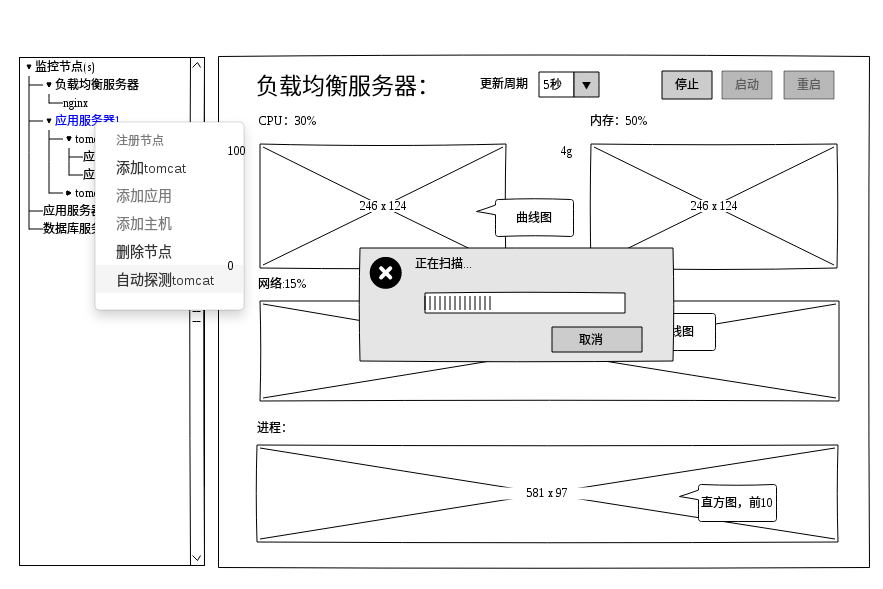
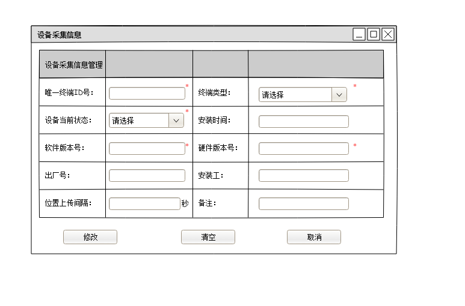

# 需求规格说明

|变更人	|变更内容	|变更时间	|软件版本	|备注|
|----|----|----|----|----|
|宋宗权|起草|星期四, 18. 一月 2018 10:15上午 |v0.1|   |
|宋宗权|添加平台监控|星期一, 22. 一月 2018 03:58下午  |v0.1|   |
|刘彬玲|添加车队信息管理|星期二, 23. 一月 2018 17:17下午  |v0.1|   |
|吴迪|添加运输公司信息管理|星期二, 23. 一月 2018 17:17下午  |v0.1|   |
|程明|添加地域信息管理|星期二, 23. 一月 2018 17:17下午  |v0.1|   |
|程明|添加驾驶员信息管理|星期二, 27. 二月 2018 17：:41下午  |v0.1|   |
|程明|添加采集设备管理|星期二, 06. 三月 2018 10：:21上午  |v0.1|   |
|程明|添加车辆信息管理|星期四, 15. 三月 2018 15：:03下午  |v0.1|   |

## 概述
   （系统的背景知识，整体的描述）
## 角色与用例
列出所有角色与用例及两者的执行关系（此处用use case总图）
### 系统角色
* 系统管理员
* 保险公司管理者
* 运输公司管理者
* 驾驶员
* 保险公司查勘员
* 车载设备

### 用例清单

* 平台监控-主机性能监控
* 平台监控- jvm性能状态监控
* 平台监控-应用健康状态监控
* 平台监控-平台监控节点注册
* 平台监控-平台监控节点启停
* 车队信息管理-查询
* 车队信息管理-删除
* 车队信息管理-修改
* 车队信息管理-新增
* 车队信息管理-导出
* 运输公司信息管理-新增
* 运输公司信息管理-查询
* 运输公司信息管理-删除
* 运输公司信息管理-修改
* 运输公司信息管理-Ecxel导出
* 地域信息管理-查询
* 地域信息管理-添加
* 地域信息管理-修改
* 地域信息管理-删除
* 地域信息管理-excel导出
* 地域信息管理-excel导入
* 保险公司信息管理-查询
* 保险公司管理-添加
* 保险公司管理-修改
* 保险公司管理-删除
* 保险公司管理-excel导出
* 保险公司管理-excel导入
* 驾驶员信息管理-查询
* 驾驶员信息管理-添加
* 驾驶员信息管理-修改
* 驾驶员信息管理-删除
* 驾驶员信息管理-excel导出
* 驾驶员信息管理-excel导入
* 采集设备信息管理-查询
* 采集设备信息管理-添加
* 采集设备信息管理-修改
* 采集设备信息管理-删除
* 采集设备信息管理-excel导出
* 车辆信息管理-查询
* 车辆信息管理-添加
* 车辆信息管理-修改
* 车辆信息管理-删除
* 车辆信息管理-excel导出

* 系统配置-添加配置参数和值（通用）
* 系统配置-删除配置参数和值 （通用）
* 系统配置-修改参数的值 （通用）
* 系统配置-检索参数 （通用）

## 用例详解

### 系统配置-参数检索
适用执行者：系统管理员

#### 前置条件
 用户登录，且为管理员。
#### 操作步骤

**基本流程**
1. 用户通过菜单进入“系统配置”功能，系统展示一个参数列表查询界面，并提供新增＼删除＼修改按钮．列表带分页效果；列表有三列：参数名，参数值．备注
2. 用户在查询条件＂参数名＂处，输入参数名关键字，点击＂查询＂按钮，系统开始查询，并提示返回的结果．如下图：

如图：

 

#### 业务规则
1. 支持模糊查询
2. 支持列表的分页查询．
3. 结果列表首行有复选框可多选．
4.提供新增，删除，修改按钮．

#### 后置条件
数据库中新加了一条参数数据　

### 系统配置-添加配置参数和值
适用执行者：系统管理员

#### 前置条件
 用户登录，且为管理员。
#### 操作步骤

**基本流程**
1. 用户通过菜单进入“系统配置”功能，系统展示一个参数列表查询界面，并提供新增＼删除＼修改按钮．列表带分页效果；列表有三列：参数名，参数值．备注
2. 用户选择＂新增＂功能，系统会在列表最前面加一行，参数名，参数值这两列单元格处理可编辑状态．可以输入文本．
3. 用户在此行分别输入参数名，参数值，以及备注信息，回车或失去焦点时，系统保存信息．并将此行转换成非编辑模式，即查看模式．表示已经保存．
如图：

 

#### 业务规则
1. 要求参数名，参数值不能为空．如果为空要在输入库位置提示不能为空字样．
2. 参数名是唯一的，不能重复．如有重复，系统要提示．
3. 参数名必须是小写字母加小数点组合，点前面为前缀，后面为具体的参数名．也可以不要小数点．
3. 列表查询的查询条件有，参数名，并支持模糊查询．
4. 另外，在单元格上双击，也可以激活编辑功能．此时　可以更新参数名或参数值的数据．
5. 程序取参数值时要以参数名为标识．

#### 后置条件
数据库中新加了一条参数数据　

### 系统配置-删除配置参数和值
适用执行者：系统管理员

#### 前置条件
 用户登录，且为管理员。
#### 操作步骤

**基本流程**
1. 用户通过菜单进入“系统配置”功能，系统展示一个参数列表查询界面，并提供新增＼删除＼修改按钮．列表带分页效果；列表有三列：参数名，参数值．备注
2. 用户在参数名中输入关键字模糊查询后，系统列出结果．
3. 用户在选择一个参数，点击删除按钮，或者后面的删除连接．系统提示＂是否确定要删除＂；
4. 用户确定删除，系统删除该参数，并刷新列表，以示成功．

基它流程：
1. 用户可以在数据行前面的复选框上多选，然后统一点＂删除＂按钮，可以批量删除．

如图：

 

#### 业务规则
１．支持批量删除．

#### 后置条件
数据库中减少了一条参数数据　

### 系统配置-修改参数的值

适用执行者：系统管理员

#### 前置条件
 用户登录，且为管理员。
#### 操作步骤

**基本流程**
1. 用户通过菜单进入“系统配置”功能，系统展示一个参数列表查询界面，并提供新增＼删除＼修改按钮．列表带分页效果；列表有三列：参数名，参数值．备注
2. 用户在参数名中输入关键字模糊查询后，系统列出结果．
3. 用户在选择一个参数，点击修改按钮，或者后面的修改连接．系统将该行的单元格内生成编辑框　；
4. 用户在编辑框中修改值，回车，或者失去集点，系统直接保存更新，并退出编辑模式，回到查看模式．显示更新后的内容．

基它流程：
1. 用户可以在数据行上的单元格中双击．也可以打开编辑框进行修改内容．

如图：

 
中的第一行的编辑模式．

#### 业务规则
１．一次只能编辑一行数据．

#### 后置条件
数据库中减少了一条参数数据　

### 平台监控-主机性能监控

适用执行者：系统管理员

#### 前置条件
 用户登录，且为管理员。
#### 操作步骤

**基本流程**
1. 用户通过菜单进入“平台监控”功能，系统展示一个监控总揽界面，左面为一个树形的导航菜单，第一级节点为按职责命名的节点，如负载均衡服务器、应用集群、数据库集群等;第二级可以为主机、第三级tomcat监控、第四级应用监控; 右面为工作区，用于展示监控信息的图表数据
2. 用户在左侧导航菜单中通过鼠标选择任一台主机，右面工作区中显示主机性能监控界面，内容包括cpu、内存、网络使用情况、进程资源占用情况、如下图

 

#### 业务规则
1. 要求内存、cpu使用情况、网络使用情况不但能显示当前值，并且可实时的不断随时间变化生成曲线
2. 数据采样频率缺省5秒一次，但频率可以调节。
3. 采集历史数据要求保留一天
4. 如果哪个主机资源已经超过设置的上限，应该以红色图标以示告警
5. 曲线图x坐标为单位为秒的时间轴，y坐标为当前指标的最大值
6. 进程直方图显示占cpu最多的进程的前10名，并且也是不断的随着刷新周期刷新
7. 当打开监控界面时，监控界面会以独立线程不断地从服务端得到最新的数据，并非从数据库中取，这个数据不需保存，只反应当前的状态
8. 另外有独立线程会不断采集同类信息并保存到数据库中，以备静态分析所需，这个线程的采样时间可以较长，并且可以调节。

#### 后置条件
无

### 平台监控-tomcat性能状态监控

#### 前置条件
 用户登录，且为管理员。
#### 操作步骤

**基本流程**
1. 用户通过菜单进入“平台监控”功能，系统展示一个监控总揽界面，左面为一个树形的导航菜单，第一级节点为按职责命名的节点，如负载均衡服务器、应用集群、数据库集群等;第二级可以为主机、第三级tomcat监控、第四级应用监控; 右面为工作区，用于展示监控信息的图表数据
2. 用户在左侧导航菜单中通过鼠标选择任一台主机下的tomcat,右面工作区中显示tomcat性能监控界面，内容包括jvm内存使用情况，线程使用情况,参考tomcat 服务状态监控信息，如下图
 

#### 业务规则
1. 要求内存、线程使用情况不但能显示当前值，并且可显示随时间变化曲线
2. 数据采样频率缺省5秒一次，但频率可以调节。
3. 采集历史数据要求保留一天
4. 如果哪个主机资源已经超过设置的上限，应该以红色图标显示在tomat节点后面，以示告警
5. 左上角的jvm内存图，是指的总内存与当前使用内存的曲线
6. 右上角的内存池图，是将jvm内存类型区分开，一类一个柱子，一个柱子用不同颜色给示初始内存多少，用了多少，最大多少。种类有：PS Eden Space、PS Old Gen、PS Survivor Space、Code Cache、Compressed Class Space、Metaspace
7. 中间的线程图，是指最大支持线程数与当前线程数的实时曲线，同时显示线程达到百分比，后面也要显示忙的线程几个，总请求次数是多少，出错的请求有几个等 
8. 最下面的慢线程排名图，用柱状图来展示，将取得响应时间最长的前10名的线程，鼠标放在柱上时，要显示它的平均响应时间以及请求路径是什么
9. 以上指标tomcat的manager服务可以拿到

#### 后置条件
无

### 平台监控-应用健康状态监控

#### 前置条件
 用户登录，且为管理员。
#### 操作步骤

**基本流程**
1. 用户通过菜单进入“平台监控”功能，系统展示一个监控总揽界面，左面为一个树形的导航菜单，第一级节点为按职责命名的节点，如负载均衡服务器、应用集群、数据库集群等;第二级可以为主机、第三级tomcat监控、第四级应用监控; 右面为工作区，用于展示监控信息的图表数据，如图
2. 用户在左侧导航菜单中通过鼠标选择任一台主机下的tomcat下的任意一个应用，右面工作区中显示应用状态监控界面，内容包括运行状态、应用名称、路径、版本、会话数量、当前所有的历史数据统的运行状态的分布图（用饼图）、会话数在所有历史数据中按时间顺序中的曲线表示，如图
 

#### 业务规则
1. 要求各性能指标图使用情况不但能显示当前值，并且可显示随时间变化曲线，采样周期也要可以调节
2. 数据采样频率缺省5秒一次，但频率可以调节。
3. 采集历史数据缺省要求保留一天
4. 如果那个应用没启动，应以灰色图标显示，如果启动但不正常 ，应以红色图标展示。如果性能告警，应以黄色图标展示。注意彩色图标标在树中的节点后面以及工作区中的运行状态处。同时文字也标上同样的颜色
5. 运行状态分布图的指标有三个：健康运行、停止、不健康运行
6. 会话曲线用来了解一天内什么时间访问量大、在线量大

#### 后置条件
无

### 平台监控-平台监控节点注册

#### 前置条件
 用户登录，且为管理员。
#### 操作步骤

**基本流程**
1. 用户通过菜单进入“平台监控”功能，系统展示一个监控总揽界面，左面为一个树形的导航菜单，第一级节点为按职责命名的节点，如负载均衡服务器、应用集群、数据库集群等;第二级可以为主机、第三级tomcat监控、第四级应用监控; 右面为工作区，用于展示监控信息的图表数据，如图
2. 用户在左侧导航菜单中通过鼠标右键打开一或键菜单，菜单中列出几个可能选择：添加主机节点、添加tomcat节点、添加应用节点、添加数据库节点等
3. 用户选择执行任意一个添加节点功能，系统右面工作区弹出一个注册信息输入对话框　，不同的的节点类型需要信息不同，详情在业务规则中表述，界面如图
 

4. 用户输入节点需要的信息，点击保存;系统提示保存成功后,并立即刷新左边的导航树。

特殊流程：
另一种注册方式，针对tomcat与app,举例说明
1. 用户在tomcat节点上右键打开菜单，并选择＂自动探测ａｐｐ＂，系统开始扫描探测，并提示一个进度条（进度条可如图所示或是当前节点后有一个转圈的动态进度图标），扫描完毕在当前节点下一级自动添加展示出发现的应用．

 

#### 业务规则
1. 要求用户在鼠标右键时，根据当前选中的上级节点决定应该可以添加哪一种节点类型
2. 在树节点上激活右键菜单时，菜单项要根据当前选中的节点类型，让合适的菜单可用。如：你选择的是应用服务器，此时就只能添加tomcat,如果你选中的是tomcat,就只能选择添加应用,其它菜单置为灰色禁用
3. 上面的示意图省略了应用、主机信息的注册;界面布局基本相同只是属性值不同;主机信息的属性主要有名称、ip地址、管理账户、管理密码等;管理账户与密码是指的是用于ssh服务的，可以远程登录上云操作命令;应用的信息主要参考应用监控界面的那些信息
4. 此功能在实现手工注册的基础上，尽量实现tomcat,app的自动探测功能，通过与操作系统的shell沟通找到所有tomcat安装位置，然后从其配置文件中提取相关信息。直接注册tomcat;另一个通过tomcat内置的manager 功能直接提取app列表。自动注册app，以方便维护;由于不敢保证所有的tomcat的manager都可能正常工作，或者可能并不是采用的tomcat，所以有必要保留基本的手工注册功能。在性能状态数据提取上，应尽量采用中立的技术实现。不要依赖于某一种j2ee容器，比如用jvm内置的状态查询工具。

#### 后置条件
节点信息入库保存。

### 平台监控-平台监控节点启停

#### 前置条件
 用户登录，且为管理员。并且选中的节点为可启停的节点
#### 操作步骤

**基本流程**
1. 用户通过菜单进入“平台监控”功能，系统展示一个监控总揽界面，左面为一个树形的导航菜单，第一级节点为按职责命名的节点，如负载均衡服务器、应用集群、数据库集群等;第二级可以为主机、第三级tomcat监控、第四级应用监控; 右面为工作区，用于展示监控信息的图表数据，如图
2. 用户在左侧导航菜单中选择一个节点点击左键，如tomcat,工作区中会提示几个可能选择的按钮：启动、停止、重启
3. 用户选择执行任意一个添加节点功能，系统在右工作区显示一个模拟的进度条，达以100%后提示启动（停止/重启）成功。

#### 业务规则

1. 如果节点状态已是是启动状态，则不能用启动按钮,同样如果当前为停止，则不能用停止按钮
2. 主机，tomcat,应用三类节点都可以重启，停止

#### 后置条件
节点对应用的服务启动或停止 

### 车队信息管理-查询
适用者：运输公司管理者
#### 前置条件
 1.系统角色为运输公司管理者；2.打开车队信息页面
#### 操作步骤

**基本流程**
1.用户在车队名称输入框输入想要查询的车队名、上级部门、地区，点击查询按钮；系统返回符合条件的车队列表在下方显示。车队列表显示信息包括：车队名称，上级部门，所属业户，经营许可证字，经营许可证号，经营范围，所属地区，联系人，联系电话，备注，保险公司 如下图
 

**特殊流程**
1.用户直接点击查询按钮；系统返回所有车队信息在下方展示
**特殊流程**
1.用户在车队名称输入框输入想要查询的车队名，系统记录车队名；2.用户点击重置按钮，系统清空输入框中的车队名

#### 业务规则
1.模糊查询，查询出所有车队名含有查询内容的车队信息
2.车队名称、保险公司、上级部门非空
3.校验信息：联系电话为11位数字；
4.备注信息为大文本输入

#### 后置条件

### 车队信息管理-删除
适用者：运输公司管理者
#### 前置条件
 1.系统角色为运输公司管理者；2.打开车队信息页面
#### 操作步骤

**基本流程**
1.用户在车队名称输入框输入想要查询的车队名，点击查询按钮；系统返回符合条件的车队列表在下方显示。
2.用户点击想要删除的车队信息一栏的删除选项，系统弹出“确定要删除**”提示框
3.用户点击确定删除，系统删除该车队信息记录并刷新页面

**特殊流程**
1.用户在车队名称输入框输入想要查询的车队名，点击查询按钮；系统返回符合条件的车队列表在下方显示。
2.用户勾选想要删除的车队信息一栏的左侧复选框，点击批量删除，系统弹出“确定要删除**”提示框
3.用户点击确定删除，系统删除所有选中车队信息记录并刷新页面

**特殊流程**
1.用户在车队名称输入框输入想要查询的车队名，点击查询按钮；系统返回符合条件的车队列表在下方显示。
2.用户点击想要删除的车队信息一栏的删除选项，系统弹出“确定要删除**”提示框
3.用户点击取消，系统关闭提示框，不作任何操作

#### 业务规则
1.删除前提示带有车队名信息

#### 后置条件
1.删除库中选中车队信息

### 车队信息管理-修改
适用者：运输公司管理者
#### 前置条件
 1.系统角色为运输公司管理者；2.打开车队信息页面
#### 操作步骤

**基本流程**
1.用户在车队名称输入框输入想要查询的车队名，点击查询按钮；系统返回符合条件的车队列表在下方显示。
2.用户点击想要修改的车队的修改按钮；系统弹出该车队详细信息页面；详情页信息包括：车队名称，上级部门，所属业户，经营许可证字，经营许可证号，经营范围，所属地区，联系人，联系电话，备注，保险公司 如下图

 

3.用户在对应栏目中进行修改，系统记录修改信息
4.用户点击确定按钮，系统修改库中车队信息并关闭详情页，刷新车队信息页面

**特殊流程**
1.用户在车队名称输入框输入想要查询的车队名，点击查询按钮；系统返回符合条件的车队列表在下方显示。
2.用户点击想要修改的车队的修改按钮；系统弹出该车队详细信息页面
3.用户在对应栏目中进行修改，系统记录修改信息
4.用户点击取消按钮，系统关闭详情页，不刷新车队信息页面

#### 业务规则
1.信息回显
2.车队名称、保险公司、上级部门不为空；校验为空，提交不通过并输入框高亮显示
3.上级部门为带搜索下拉框，框内信息树形结构展示，框中内容为已有的运输公司信息
4.保险公司为带搜索下拉框，框内信息树形结构展示，框中内容为已有的保险公司信息
5.所属地区为带搜索下拉框，框内信息树形结构展示，框中内容为已有的地域信息
6.电话号码11位数字校验

#### 后置条件
1.修改数据库中对应车队信息

### 车队信息管理-新增
适用者：运输公司管理者
#### 前置条件
 1.系统角色为运输公司管理者；2.打开车队信息页面
#### 操作步骤

**基本流程**
1.用户点击新增按钮；系统弹出车队信息新增页面；页面信息包括：车队名称，上级部门，所属业户，经营许可证字，经营许可证号，经营范围，所属地区，联系人，联系电话，备注，保险公司 如下图

2.用户输入车队信息；系统记录已输入信息
3.用户点击保存按钮，系统向库中保存该车队信息并关闭新增页面，刷新车队信息页面 

#### 业务规则
1.车队名称、保险公司、上级部门不为空；校验为空，提交不通过并输入框高亮显示
2.上级部门为带搜索下拉框，框内信息树形结构展示，框中内容为已有的运输公司信息
3.保险公司为带搜索下拉框，框内信息树形结构展示，框中内容为已有的保险公司信息
4.所属地区为带搜索下拉框，框内信息树形结构展示，框中内容为已有的地域信息
5.电话号码11位数字校验

#### 后置条件
1.在数据库中增加车队信息

### 车队信息管理-导出
适用者：运输公司管理者
#### 前置条件
 1.系统角色为运输公司管理者；2.打开车队信息页面
#### 操作步骤

**基本流程**
1.用户在车队名称输入框输入想要查询的车队名，点击查询按钮；系统返回符合条件的车队列表在下方显示。车队列表显示信息包括：车队名称，上级部门，所属业户，经营许可证字，经营许可证号，经营范围，所属地区，联系人，联系电话，备注，保险公司 如下图
 

2.用户点击导出按钮，系统导出当前查询到的车队列表的excel表格

#### 业务规则
1.模糊查询，查询出所有车队名含有查询内容的车队信息
2.文件命名规则为：“车队信息”+当天日期+当天下载次数（例如2018012322，表示2018-1-23第22次下载）

#### 后置条件
1.下载保存excel表格

### 运输公司信息管理-新增

适用执行者：业务管理员

#### 前置条件

 需要进行身份认证，认证业务管理员身份后可执行。
 新增前要进行查询操作。

#### 操作步骤

**基本流程**

1. 用户点击增加，系统将弹出信息增加页面，可以添加的信息包括：运输公司名称、上级部门、运输公司类型、所属业户、经营许可证字、经营许可证号、经营范围、所属地区、联系人、联系人电话、备注、保险公司。
2. 用户输入运输公司名称后，系统会异步查询运输公司信息是否已存在，若存在弹出提示：“运输公司已存在！” ，否则系统不会有任何提示。
3. 用户将信息输入完成后，可点击保存，若必填项为空，系统将弹出提示：“必填项不能为空！”，用户完善信息后，用户点击保存，系统将给予添加成功或失败的反馈。
    

#### 业务规则
1.运输公司名称和运输公司类型为必填项

2.上级部门、运输公司类型、所属地区、保险公司为搜索下拉框。

3.联系电话11位纯数字校验

#### 后置条件

无

### 运输公司信息管理-查询

适用执行者：业务管理员

#### 前置条件

 需要进行身份认证，认证业务管理员身份后可执行。

#### 操作步骤

**基本流程**

1. 用户浏览运输公司信息管理页面，系统会默认在页面展示10条运输公司信息，页面下方可翻页。
2. 用户在搜索框输入运输公司名称、所属地区、运输公司类型，点击查询，系统将反馈查询到的结果，没有内容表示系统内不存在该运输公司信息。
    
 
#### 业务规则

无

#### 后置条件

无

### 运输公司信息管理-修改

适用执行者：业务管理员

#### 前置条件

 需要进行身份认证，认证业务管理员身份后可执行。
 

#### 操作步骤

**基本流程**

1. 用户在搜索框输入想要查询的运输公司名称，查询想要修改的运输公司信息。
2. 用户点击编辑，系统弹出编辑页面，可以编辑的信息会回显到系统页面上，包括：运输公司名称、上级部门、运输公司类型、所属业户、经营许可证字、经营许可证号、经营范围、所属地区、联系人、联系人电话、备注、保险公司。
3. 用户若修改运输公司名称，系统将异步查询修改后的运输公司名称是否存在，若存在，系统将给出提示：“该运输公司名称已存在！”，否则系统不会给出提示。
4. 用户完善信息后确定点击保存，系统将判断必填项是否为空，若为空提示：“请检查是否填写必填项”，保存成功或失败系统将有相应的提示。

    

#### 业务规则

1.运输公司名称和运输公司类型为必填项

2.上级部门、运输公司类型、所属地区、保险公司为搜索下拉框

3.联系电话11位纯数字校验

#### 后置条件

无

### 运输公司信息管理-删除

适用执行者：业务管理员

#### 前置条件

 需要进行身份认证，认证业务管理员身份后可执行。

#### 操作步骤

**基本流程**

1. 用户在搜索框输入想要删除的运输公司名称，点击查询，系统将反馈查询的运输公司信息，无显示内容表示该运输公司不存在。
2. 用户点击删除，系统将弹出提示：“是否确定删除xx？”，用户点击确定系统将删除选中的信息并刷新页面，点击取消系统不会有任何操作。

**特殊流程**

1.用户在搜索框输入想要删除的运输公司名称，点击查询，系统将反馈查询的运输公司信息，无显示内容表示该运输公司不存在。

2.用户勾选想要删除的车队信息一栏的左侧复选框，点击批量删除，系统弹出“确定要删除**”提示框

3.用户点击确定删除，系统删除所有选中车队信息记录并刷新页面
    

#### 业务规则

无

#### 后置条件

无

### 运输公司信息管理-Ecxel导出

适用执行者：业务管理员

#### 前置条件

 需要进行身份认证，认证业务管理员身份后可执行。

#### 操作步骤

**基本流程**

1.用户点击导出，系统可以将运输公司信息导出为Excel文件，文件中的数据为所有的运输公司信息，包括运输公司名称、上级部门、运输公司类型、所属业户、经营许可证字、经营许可证号、经营范围、所属地区、联系人、联系人电话、备注、保险公司。
    

#### 业务规则

文件命名规则为：“运输公司”+当天日期+当天下载次数（例如2018012322，表示2018-1-23第22次下载）。

#### 后置条件

无

### 地域信息管理-查询

适用执行者：业务管理员

#### 前置条件
 用户登录，且为管理员
#### 操作步骤

**基本流程**

1. 用户通过菜单进入“地域信息管理”，系统展示一个地域信息管理界面，上面是地域名称，类型下拉框，父级地域下拉框的输入和查询，重置，新增，Excel导出按钮，Excel导入，下面是展示省份信息的数据显示
2. 用户在输入完想查询的信息后，下面图表将显示出相关的信息

#### 业务规则
1. 当用户什么信息都没填写时，点击查询，展现数据库所有的数据
2. 当用户选择重置按钮时，清空输入的信息
3. 当用户选择查询按钮后，数据每页显示15条信息
4. 在类型下拉框中，分别有省（直辖市），市，区/镇，县/乡选项。
5. 在父级地域下拉框中，是树形结构，点开父级名称打开所属的子集名称，结构依次为国家，省份，城市，区，县。

#### 后置条件
无

### 地域信息管理-添加

适用执行者：业务管理员

#### 前置条件
 用户登录，且为管理员
#### 操作步骤

**基本流程**

1. 用户通过菜单进入“地域信息管理”，系统展示一个地域信息管理界面，上面是省份名称，城市名称，区/县级名称，镇/乡级名称的输入和查询，重置，新增，Excel导出按钮，下面是展示省份信息的数据显示

2. 用户点击新增按钮后，弹出新的页面（模态框），从上至下依次是地域名称，编号，类型，父级地域，下面有三个按钮并排放置，依次是添加，清空，取消按钮，输入完信息后，点击添加按钮，保存成功。清空按钮为清空所填数据，取消则关闭模态框。

#### 业务规则
1. 在新增页面模态框中，类型信息是下拉框，可供选择省（直辖市），市，区/镇，县/乡选项。
2. 在新增页面模态框中，父级地域信息是可供搜索的下拉框，打开下拉框，里面是树形结构，点开父级名称打开所属的子集名称，结构依次为国家，省份，城市，区，县。
3. 在新增页面模态框中，地域名称，类型，父级地域不为空，是必填项，编号为只读选项。
4. 在新增页面模态框中，编号生成规则参考《中华人民共和国行政区划代码 GB-T2260-2007》

#### 后置条件
1. 当用户在模态框中点击“是”按钮后，后台相应的要存入对应的数据到数据库中。

### 地域信息管理-修改

适用执行者：业务管理员

#### 前置条件
 用户登录，且为管理员
#### 操作步骤

**基本流程**

1. 用户通过菜单进入“地域信息管理”，系统展示一个地域信息管理界面，上面是省份名称，城市名称，区/县级名称，镇/乡级名称的输入和查询，重置，新增，Excel导出按钮，下面是展示省份信息的数据显示
2. 用户点击查询后，出现相关信息的数据表格，点击编辑按钮，弹出新的页面（模态框），从上至下依次是地域名称，编号，类型，父级地域，下面有三个按钮并排放置，依次是修改，清空，取消按钮，输入完信息后，点击修改按钮，修改成功。清空按钮为清空所填数据，取消则关闭模态框。

#### 业务规则
1.  在修改页面模态框中，类型信息是下拉框，可供选择省（直辖市），市，区/镇，县/乡选项。
2.  在修改页面模态框中，父级地域信息是可供搜索的下拉框，打开下拉框，里面是树形结构，点开父级名称打开所属的子集名称，结构依次为国家，省份，城市，区，县。
3.  在修改页面模态框中，地域名称，编号，类型，父级地域不为空，是必填项，编号为只读选项。
4. 在新增页面模态框中，编号为自动生成，当填写完地域名称类型和父级地域后，编号生成，编号生成规则为类型前三等级为01开始增加，后俩等级为001开始增加，例如地域名称写北京，类型选择省/直辖市，父级地域选择中国，则生成的编号为01。

#### 后置条件
1. 当用户在模态框中点击“是”按钮后，后台相应的要修改对应的数据到数据库中。

### 地域信息管理-删除

适用执行者：业务管理员

#### 前置条件
 
用户登录，且为管理员

#### 操作步骤

**基本流程**

1. 用户通过菜单进入“地域信息管理”，系统展示一个地域信息管理界面，上面是省份名称，城市名称，区/县级名称，镇/乡级名称的输入和查询，重置，新增，Excel导出按钮，下面是展示省份信息的数据显示
2. 用户点击查询后，出现相关信息的数据表格，点击删除按钮，弹出提示框显示是否删除，点击确定则删除成功，取消则取消删除。

#### 业务规则
无

#### 后置条件
1. 当用户在提示框中点击“确定”按钮后，后台相应的要删除对应的数据在数据库中。

### 地域信息管理-excel导出

适用执行者：业务管理员

#### 前置条件
 
用户登录，且为管理员

#### 操作步骤

**基本流程**

1. 用户通过菜单进入“地域信息管理”，系统展示一个地域信息管理界面，上面是省份名称，城市名称，区/县级名称，镇/乡级名称的输入和查询，重置，新增，Excel导出按钮，下面是展示省份信息的数据显示
2. 用户点击excel导出后，下载相关的表格信息（文件格式为excel）到本地

#### 业务规则
1. 在点击导出excel按钮后，生成的excel表格数据只有在页面上显示的地域信息。
2. 文件命名规则为：“地域信息”+当天日期+当天下载次数（例如2018012322，表示2018-1-23第22次下载）

#### 后置条件
无

### 地域信息管理-excel导入

适用执行者：业务管理员

#### 前置条件
 
用户登录，且为管理员

#### 操作步骤

**基本流程**

1. 用户通过菜单进入“地域信息管理”，系统展示一个地域信息管理界面，上面是省份名称，城市名称，区/县级名称，镇/乡级名称的输入和查询，重置，新增，Excel导出按钮，下面是展示省份信息的数据显示
2. 用户点击excel导入后，弹出文件资源管理器，选择要导入的excel文件，点击确定，如果格式匹配，弹出提示框“导入成功”。

#### 业务规则
无

#### 后置条件
1.导入excel后，相应的数据信息存入数据库。

### 保险公司信息管理-查询

适用执行者：业务管理员

#### 前置条件
 用户登录，且为管理员
#### 操作步骤

**基本流程**

1. 用户通过菜单进入“保险公司信息管理”，系统展示一个保险公司信息管理界面，上面是保险公司名称和所属上级的下拉框的输入和查询，重置，新增，批量删除，Excel导出按钮，Excel导入，下面是展示保险公司信息的数据显示：保险公司名称，所属上级，联系电话，地址
2. 用户在输入完想查询保险公司的信息后，下面图表将显示出相关的信息

#### 业务规则
1. 当用户什么信息都没填写时，点击查询，展现数据库所有的数据
2. 当用户选择重置按钮时，清空输入的信息
3. 当用户选择查询按钮后，数据每页显示20条信息
4. 在所属上级下拉框中，是树形结构，点开父级名称打开所属的子集名称，数据为已有保险公司信息
5. 分页展示页数下拉框为10，15，20，50
#### 后置条件
无

### 保险公司信息管理-添加

适用执行者：业务管理员

#### 前置条件
 用户登录，且为管理员
#### 操作步骤

**基本流程**

1. 用户通过菜单进入“保险公司信息管理”，系统展示一个保险公司信息管理界面，上面是保险公司名称，所属上级的输入和查询，重置，新增，Excel导出按钮，下面是展示保险公司信息的数据显示：保险公司名称，所属上级，联系电话，地址

2. 用户点击新增按钮后，弹出新的页面（模态框），从上至下依次是保险公司名称，所属上级，联系电话，地址，下面有三个按钮并排放置，依次是添加，清空，取消按钮，输入完信息，点击添加按钮，保存成功。清空按钮为清空所填数据，取消则关闭模态框。

#### 业务规则
1. 在新增页面模态框中，所属上级是下拉框，树形结构，内容为已有保险公司信息。
2. 在新增页面模态框中，保险公司名称，所属上级不为空，是必填项。
3. 联系电话11位纯数字校验
#### 后置条件
1. 当用户在模态框中点击“是”按钮后，后台相应的要存入对应的数据到数据库中。

### 保险公司信息管理-修改

适用执行者：业务管理员

#### 前置条件
 用户登录，且为管理员
#### 操作步骤

**基本流程**

1. 用户通过菜单进入“保险公司信息管理”，系统展示一个保险公司信息管理界面，上面是保险公司名称，所属上级的输入和查询，重置，新增，Excel导出按钮，下面是展示保险公司信息的数据显示：保险公司名称，所属上级，联系电话，地址
2. 
2. 用户点击查询后，出现相关信息的数据表格，点击编辑按钮，弹出新的页面（模态框），从上至下依次是保险公司名称，编号，类型，父级保险公司，下面有三个按钮并排放置，依次是修改，清空，取消按钮，输入完信息后，点击修改按钮，修改成功。清空按钮为清空所填数据，取消则关闭模态框。

#### 业务规则
1. 在新增页面模态框中，所属上级是下拉框，树形结构，内容为已有保险公司信息。
2. 在新增页面模态框中，保险公司名称，所属上级不为空，是必填项。
3. 联系电话11位纯数字校验
4. 
#### 后置条件
1. 当用户在模态框中点击“是”按钮后，后台相应的要修改对应的数据到数据库中。

### 保险公司信息管理-删除

适用执行者：业务管理员

#### 前置条件
 
用户登录，且为管理员

#### 操作步骤

**基本流程**

1. 用户通过菜单进入“保险公司信息管理”，系统展示一个保险公司信息管理界面，上面是保险公司名称，所属上级的输入和查询，重置，新增，Excel导出按钮，下面是展示保险公司信息的数据显示：保险公司名称，所属上级，联系电话，地址
2. 用户点击查询后，出现相关信息的数据表格，点击删除按钮，弹出提示框显示是否删除，点击确定则删除成功，取消则取消删除。

#### 业务规则
无

#### 后置条件
1. 当用户在提示框中点击“确定”按钮后，后台相应的要删除对应的数据在数据库中。

### 保险公司信息管理-批量删除

适用执行者：业务管理员

#### 前置条件
 
用户登录，且为管理员

#### 操作步骤

**基本流程**

1. 用户通过菜单进入“保险公司信息管理”，系统展示一个保险公司信息管理界面，上面是保险公司名称，所属上级的输入和查询，重置，新增，Excel导出按钮，下面是展示保险公司信息的数据显示：保险公司名称，所属上级，联系电话，地址
2. 用户点击查询后，出现相关信息的数据表格，勾选想要删除对象的复选框，点击批量删除按钮，弹出提示框显示是否删除，点击确定则删除成功，取消则取消删除。

#### 业务规则
无

#### 后置条件
1. 当用户在提示框中点击“确定”按钮后，后台相应的要删除对应的数据在数据库中。

### 保险公司信息管理-excel导出

适用执行者：业务管理员

#### 前置条件
 
用户登录，且为管理员

#### 操作步骤

**基本流程**

1. 用户通过菜单进入“保险公司信息管理”，系统展示一个保险公司信息管理界面，上面是保险公司名称，所属上级的输入和查询，重置，新增，Excel导出按钮，下面是展示保险公司信息的数据显示：保险公司名称，所属上级，联系电话，地址
2. 用户点击excel导出后，下载相关的表格信息（文件格式为excel）到本地

#### 业务规则
1. 在点击导出excel按钮后，生成的excel表格数据只有在页面上显示的保险公司信息。
2. 文件命名规则为：“保险公司信息”+当天日期+当天下载次数（例如2018012322，表示2018-1-23第22次下载）

#### 后置条件
无

### 保险公司信息管理-excel导入

适用执行者：业务管理员

#### 前置条件
 
用户登录，且为管理员

#### 操作步骤

**基本流程**

1. 用户通过菜单进入“保险公司信息管理”，系统展示一个保险公司信息管理界面，上面是保险公司名称，所属上级的输入和查询，重置，新增，Excel导出按钮，下面是展示保险公司信息的数据显示：保险公司名称，所属上级，联系电话，地址
2. 用户点击excel导入后，弹出文件资源管理器，选择要导入的excel文件，点击确定，如果格式匹配，弹出提示框“导入成功”。

#### 业务规则
无

#### 后置条件
1.导入excel后，相应的数据信息存入数据库。

### 驾驶员信息管理-查询

适用执行者：业务管理员

#### 前置条件
 
用户登录，且为管理员

#### 操作步骤

**基本流程**

1. 用户通过菜单进入“驾驶员信息管理”，系统展示一个驾驶员信息管理界面，上面分别是是车牌号，司机姓名，身份证号，类型为输入框，查询按钮，重置按钮，新增按钮，Excel导出按钮，Excel导入按钮，下面是展示驾驶员信息的数据显示
2. 用户在输入完想查询的信息后，下面图表将显示出相关的信息

#### 业务规则
1. 当用户什么信息都没填写时，点击查询，展现数据库所有的数据
2. 当用户选择重置按钮时，清空输入的信息
3. 当用户选择查询按钮后，数据每页显示20条信息
4. 分页展示页数下拉框为10，15，20，50

#### 后置条件
无

### 驾驶员信息管理-添加

适用执行者：业务管理员

#### 前置条件
 
用户登录，且为管理员

#### 操作步骤

**基本流程**

1. 用户通过菜单进入“驾驶员信息管理”，系统展示一个驾驶员信息管理界面，上面分别是是车牌号，司机姓名，身份证号，类型为输入框，查询按钮，重置按钮，新增按钮，Excel导出按钮，Excel导入按钮，下面是展示驾驶员信息的数据显示

2. 用户点击新增按钮后，弹出新的页面（模态框），分为三个模块，分别是基本信息，驾驶证信息，从业资格证信息。基本信息中需要填写的信息为：司机姓名，身份证号，性别，驾驶车辆，联系电话，驾驶年龄，押运员姓名，出生日期，出险次数，主驾驶。驾驶证信息中需要填写的信息为：准驾车型，初次领证日期，有效日期，驾驶证号，档案编号。从业资格证信息中需要填写的信息为：从业资格证，从业资格类别，证件编号，发证机构，发证时间，过期时间，监管机构，监督电话。下面有三个按钮并排放置，依次是添加，清空，取消按钮，输入完信息，点击添加按钮，保存成功。清空按钮为清空所填数据，取消则关闭模态框。

#### 业务规则
1. 在新增页面模态框中，司机名称，身份证号，性别，驾驶车辆，联系电话，出生日期，准驾车型，初次领证日期，有效日期，驾驶证号，档案编号，从业资格证，从业资格类别，证件编号，发证机构，发证时间和过期时间是必填项。
2. 在新增页面模态框中，性别为单选项。出生日期，初次领证日期，有效日期，发证时间和过期时间为datetimepicker选项。
3. 在新增页面模态框中，驾驶车辆为两个下拉框，第一个下拉框选择车队，第二个下拉框选择这个车队里的车牌号。准驾车型为下拉框。
4. 联系电话11位纯数字校验

#### 后置条件
1. 当用户在模态框中点击添加按钮后，后台相应的要存入对应的数据到数据库中。
2. 在勾选主驾驶时，要检查驾驶车辆是否已经有主驾驶
3. 当用户在模态框中点击添加按钮后，要检查司机是否已经有5辆以上的驾驶车辆，如果有，则添加失败（每个司机最多只能添加5辆驾驶车辆）

### 驾驶员信息管理-修改

适用执行者：业务管理员

#### 前置条件
 
用户登录，且为管理员

#### 操作步骤

**基本流程**

1. 用户通过菜单进入“驾驶员信息管理”，系统展示一个驾驶员信息管理界面，上面分别是是车牌号，司机姓名，身份证号，类型为输入框，查询按钮，重置按钮，新增按钮，Excel导出按钮，Excel导入按钮，下面是展示驾驶员信息的数据显示

2. 用户点击查询后，出现相关信息的数据表格，点击编辑按钮，弹出新的页面（模态框），分为三个模块，分别是基本信息，驾驶证信息，从业资格证信息。基本信息中需要填写的信息为：司机姓名，身份证号，性别，驾驶车辆，联系电话，驾驶年龄，押运员姓名，出生日期，出险次数，主驾驶。驾驶证信息中需要填写的信息为：准驾车型，初次领证日期，有效日期，驾驶证号，档案编号。从业资格证信息中需要填写的信息为：从业资格证，从业资格类别，证件编号，发证机构，发证时间，过期时间，监管机构，监督电话。下面有三个按钮并排放置，依次是修改，清空，取消按钮，输入完信息，点击修改按钮，修改成功。清空按钮为清空所填数据，取消则关闭模态框。

#### 业务规则
1. 在新增页面模态框中，司机名称，身份证号，性别，驾驶车辆，联系电话，出生日期，准驾车型，初次领证日期，有效日期，驾驶证号，档案编号，从业资格证，从业资格类别，证件编号，发证机构，发证时间和过期时间是必填项。
2. 在新增页面模态框中，性别为单选项。出生日期，初次领证日期，有效日期，发证时间和过期时间为datetimepicker选项。
3. 在新增页面模态框中，驾驶车辆为两个下拉框，第一个下拉框选择车队，第二个下拉框选择这个车队里的车牌号。准驾车型为下拉框。
4. 联系电话11位纯数字校验

#### 后置条件
1. 当用户在模态框中点击添加按钮后，后台相应的要存入对应的数据到数据库中。
2. 在勾选主驾驶时，要检查驾驶车辆是否已经有主驾驶
3. 当用户在模态框中点击添加按钮后，要检查司机是否已经有5辆以上的驾驶车辆，如果有，则添加失败（每个司机最多只能添加5辆驾驶车辆）

### 驾驶员信息管理-删除

适用执行者：业务管理员

#### 前置条件
 
用户登录，且为管理员

#### 操作步骤

**基本流程**

1. 用户通过菜单进入“驾驶员信息管理”，系统展示一个驾驶员信息管理界面，上面分别是是车牌号，司机姓名，身份证号，类型为输入框，查询按钮，重置按钮，新增按钮，Excel导出按钮，Excel导入按钮，下面是展示驾驶员信息的数据显示

2. 用户点击查询后，出现相关信息的数据表格，点击删除按钮，弹出提示框显示是否删除，点击确定则删除成功，取消则取消删除。

#### 业务规则
无

#### 后置条件
1. 当用户在提示框中点击“确定”按钮后，后台相应的要删除对应的数据在数据库中。

### 驾驶员信息管理-excel导出

适用执行者：业务管理员

#### 前置条件
 
用户登录，且为管理员

#### 操作步骤

**基本流程**

1. 用户通过菜单进入“驾驶员信息管理”，系统展示一个驾驶员信息管理界面，上面分别是是车牌号，司机姓名，身份证号，类型为输入框，查询按钮，重置按钮，新增按钮，Excel导出按钮，Excel导入按钮，下面是展示驾驶员信息的数据显示

2. 用户点击excel导出后，下载相关的表格信息（文件格式为excel）到本地

#### 业务规则
1. 在点击导出excel按钮后，生成的excel表格数据只有在页面上显示的保险公司信息。
2. 文件命名规则为：“驾驶员信息”+当天日期+当天下载次数（例如2018012322，表示2018-1-23第22次下载）

#### 后置条件
无

### 驾驶员信息管理-excel导入

适用执行者：业务管理员

#### 前置条件
 
用户登录，且为管理员

#### 操作步骤

**基本流程**

1. 用户通过菜单进入“驾驶员信息管理”，系统展示一个驾驶员信息管理界面，上面分别是是车牌号，司机姓名，身份证号，类型为输入框，查询按钮，重置按钮，新增按钮，Excel导出按钮，Excel导入按钮，下面是展示驾驶员信息的数据显示

2. 用户点击excel导入后，弹出文件资源管理器，选择要导入的excel文件，点击确定，如果格式匹配，弹出提示框“导入成功”。

#### 业务规则
无

#### 后置条件
1.导入excel后，相应的数据信息存入数据库。

### 采集设备信息管理-查询

适用执行者：业务管理员

#### 前置条件
 
用户登录，且为管理员

#### 操作步骤

**基本流程**

1. 用户通过菜单进入“采集设备信息管理”，系统展示一个采集设备信息管理界面，上面分别是是终端号，绑定车辆车牌号，类型为输入框，终端类型下拉框，设备当前状态下拉框，查询按钮，重置按钮，新增按钮，Excel导出按钮，下面是展示采集设备信息的数据显示
2. 用户在输入完想查询的信息后，下面图表将显示出相关的信息

#### 业务规则
1. 当用户什么信息都没填写时，点击查询，展现数据库所有的数据
2. 当用户选择重置按钮时，清空输入的信息
3. 当用户选择查询按钮后，数据每页显示20条信息
4. 分页展示页数下拉框为10，15，20，50

#### 后置条件
无

### 采集设备信息管理-添加

适用执行者：业务管理员

#### 前置条件
 
用户登录，且为管理员

#### 操作步骤

**基本流程**

1. 用户通过菜单进入“采集设备信息管理”，系统展示一个采集设备信息管理界面，上面分别是是终端号，绑定车辆车牌号，类型为输入框，终端类型下拉框，设备当前状态下拉框，查询按钮，重置按钮，新增按钮，Excel导出按钮，下面是展示采集设备信息的数据显示
2. 用户点击新增按钮后，弹出采集设备信息页面（模态框），分别是唯一终端ID号，终端类型，设备当前状态，安装时间，软件版本号，硬件版本号，出厂号，安装工，位置上传间隔，备注。下面有三个按钮并排放置，依次是添加，清空，取消按钮，输入完信息，点击添加按钮，保存成功。清空按钮为清空所填数据，取消则关闭模态框。

#### 业务规则
1. 在新增页面模态框中，唯一终端ID号，终端类型，设备当前状态，软件版本号和硬件版本号是必填项。
2. 在新增页面模态框中，终端类型和设备当前状态是下拉框。
3. 终端类型下拉框中分别是G6，G5，E-eye，D03，D01,C7_TY_DBL_ZH选项。
4. 设备当前状态下拉框中分别是暂停，正常，脱网，已拆选项。
5. 在新增页面模态框中，安装时间为datetimepicker类型。

#### 后置条件
1. 当用户在模态框中点击添加按钮后，后台相应的要存入对应的数据到数据库中。
2. 当用户在唯一终端ID号输入并点击添加按钮后，检查此ID号是否在数据库中已经存入，若重复，则添加失败。

### 采集设备信息管理-修改

适用执行者：业务管理员

#### 前置条件
 
用户登录，且为管理员

#### 操作步骤

**基本流程**

1. 用户通过菜单进入“采集设备信息管理”，系统展示一个采集设备信息管理界面，上面分别是是终端号，绑定车辆车牌号，类型为输入框，终端类型下拉框，设备当前状态下拉框，查询按钮，重置按钮，新增按钮，Excel导出按钮，下面是展示采集设备信息的数据显示
2. 用户点击查询后，出现相关信息的数据表格，点击编辑按钮，弹出采集设备信息页面（模态框），分别是唯一终端ID号，终端类型，设备当前状态，安装时间，软件版本号，硬件版本号，出厂号，安装工，位置上传间隔，备注。下面有三个按钮并排放置，依次是修改，清空，取消按钮，输入完信息，点击修改按钮，保存成功。清空按钮为清空所填数据，取消则关闭模态框。

#### 业务规则
1. 在修改页面模态框中，唯一终端ID号，终端类型，设备当前状态，软件版本号和硬件版本号是必填项。
2. 在修改页面模态框中，终端类型和设备当前状态是下拉框。
3. 终端类型下拉框中分别是G6，G5，E-eye，D03，D01,C7_TY_DBL_ZH选项。
4. 设备当前状态下拉框中分别是暂停，正常，脱网，已拆选项。
5. 在修改页面模态框中，安装时间为datetimepicker类型。

#### 后置条件
1. 当用户在模态框中点击修改按钮后，后台相应的要存入对应的数据到数据库中。
2. 当用户在唯一终端ID号输入并点击修改按钮后，检查此ID号是否在数据库中已经存入，若重复，则添加失败。

### 采集设备信息管理-删除

适用执行者：业务管理员

#### 前置条件
 
用户登录，且为管理员

#### 操作步骤

**基本流程**

1. 用户通过菜单进入“采集设备信息管理”，系统展示一个采集设备信息管理界面，上面分别是是终端号，绑定车辆车牌号，类型为输入框，终端类型下拉框，设备当前状态下拉框，查询按钮，重置按钮，新增按钮，Excel导出按钮，下面是展示采集设备信息的数据显示
2. 用户点击查询后，出现相关信息的数据表格，点击删除按钮，弹出提示框显示是否删除，点击确定则删除成功，取消则取消删除。

#### 业务规则
无

#### 后置条件
1. 当用户在提示框中点击“确定”按钮后，后台相应的要删除对应的数据在数据库中。

### 采集设备信息管理-excel导出

适用执行者：业务管理员

#### 前置条件
 
用户登录，且为管理员

#### 操作步骤

**基本流程**

1. 用户通过菜单进入“采集设备信息管理”，系统展示一个采集设备信息管理界面，上面分别是是终端号，绑定车辆车牌号，类型为输入框，终端类型下拉框，设备当前状态下拉框，查询按钮，重置按钮，新增按钮，Excel导出按钮，下面是展示采集设备信息的数据显示

2. 用户点击excel导出后，下载相关的表格信息（文件格式为excel）到本地

#### 业务规则
1. 在点击导出excel按钮后，生成的excel表格数据只有在页面上显示的采集设备信息。
2. 文件命名规则为：“采集设备 信息”+当天日期+当天下载次数（例如2018012322，表示2018-1-23第22次下载）

#### 后置条件
无

### 车辆信息管理-查询

适用执行者：业务管理员

#### 前置条件
 
用户登录，且为管理员

#### 操作步骤

**基本流程**

1. 用户通过菜单进入“车辆信息管理”，系统展示一个车辆信息管理界面，上面分别是是车牌号码输入框，车辆组下拉框，主驾驶员名称输入框，终端卡号输入框，到期时间段，查询按钮，重置按钮，新增按钮，Excel导出按钮，下面是展示采集设备信息的数据显示
2. 用户在输入完想查询的信息后，下面图表将显示出相关的信息

#### 业务规则
1. 当用户什么信息都没填写时，点击查询，展现数据库所有的数据
2. 当用户选择重置按钮时，清空输入的信息
3. 当用户选择查询按钮后，数据每页显示20条信息
4. 分页展示页数下拉框为10，15，20，50

#### 后置条件
无

### 车辆信息管理-添加

适用执行者：业务管理员

#### 前置条件
 
用户登录，且为管理员

#### 操作步骤

**基本流程**
 
1. 用户通过菜单进入“车辆信息管理”，系统展示一个车辆信息管理界面，上面分别是是车牌号码输入框，车辆组下拉框，主驾驶员名称输入框，终端卡号输入框，到期时间段，查询按钮，重置按钮，新增按钮，Excel导出按钮，下面是展示采集设备信息的数据显示
2. 用户点击新增按钮后，弹出新的页面（模态框），分为两个模块，分别是车辆信息，行驶证信息。车辆信息中需要填写的信息为：车牌号码，终端卡号，终端类型，车辆组，行业类型，车牌颜色，车籍地，绑定终端，唯一终端ID号，发动机号，设备当前状态，安装时间，入网时间，车辆类型，所属业户，运行状态，服务开始时间和服务结束时间。行驶证信息中需要填写的信息为：品牌型号，使用性质，车架号，发证日期，有效日期，准牵引总质量，赫定在人数，总质量，整备质量和核定载质量。下面有三个按钮并排放置，依次是添加，清空，取消按钮，输入完信息，点击添加按钮，保存成功。清空按钮为清空所填数据，取消则关闭模态框。

#### 业务规则
1. 在新增页面模态框中，车牌号码，终端卡号，终端类型，车辆组，车牌颜色，唯一终端ID号，设备当前状态，安装时间和运行状态是必填项。
2. 终端类型为下拉框，下拉框中数据为数据库中设备类型的数据。车辆组为树状下拉框。下拉框中数据为数据库中运输公司的数据。行业类型为下拉框。车牌颜色为下拉框，数据为数据库中颜色类型中的数据。车籍地为树状下拉框，数据为数据库中地域的数据。 设备当前状态为下拉框。数据为数据库中设备状态中的数据。车辆类型为下拉框，数据为数据库中车辆类型中的数据。所属业户为下拉框，数据为数据库中业户中的数据。运行状态为下拉框，数据为数据库中运行状态的数据。
3. 在新增页面模态框中，安装时间和入网时间为系统时间，所以不需要管理员手动输入，打开新增页面模态框时，系统自动写入。服务开始时间和服务结束时间一样时系统自动写入，服务开始时间为系统时间，服务结束时间为一年的今天。
4. 在新增页面模态框中，绑定终端为下拉框。数据为终端数据库中的唯一终端ID号的数据。当选择后，车辆信息中的终端卡号，唯一终端ID号，终端类型，设备当前状态，安装时间会因为终端数据库中的数据自动改变。

#### 后置条件
1. 当用户在模态框中点击添加按钮后，后台相应的要存入对应的数据到数据库中。
2. 当用户在车牌号码输入并点击添加按钮后，检查此车牌号码是否在数据库中已经存入，若重复，则添加失败。

### 车辆信息管理-修改

适用执行者：业务管理员

#### 前置条件
 
用户登录，且为管理员

#### 操作步骤

**基本流程**
 
1. 用户通过菜单进入“车辆信息管理”，系统展示一个车辆信息管理界面，上面分别是是车牌号码输入框，车辆组下拉框，主驾驶员名称输入框，终端卡号输入框，到期时间段，查询按钮，重置按钮，新增按钮，Excel导出按钮，下面是展示采集设备信息的数据显示
2. 用户点击修改按钮后，弹出新的页面（模态框），分为两个模块，分别是车辆信息，行驶证信息。车辆信息中需要填写的信息为：车牌号码，终端卡号，终端类型，车辆组，行业类型，车牌颜色，车籍地，绑定终端，唯一终端ID号，发动机号，设备当前状态，安装时间，入网时间，车辆类型，所属业户，运行状态，服务开始时间和服务结束时间。行驶证信息中需要填写的信息为：品牌型号，使用性质，车架号，发证日期，有效日期，准牵引总质量，赫定在人数，总质量，整备质量和核定载质量。下面有三个按钮并排放置，依次是添加，清空，取消按钮，输入完信息，点击修改按钮，保存成功。清空按钮为清空所填数据，取消则关闭模态框。

#### 业务规则
1. 在修改页面模态框中，车牌号码，终端卡号，终端类型，车辆组，车牌颜色，唯一终端ID号，设备当前状态，安装时间和运行状态是必填项。
2. 终端类型为下拉框，下拉框中数据为数据库中设备类型的数据。车辆组为树状下拉框。下拉框中数据为数据库中运输公司的数据。行业类型为下拉框。车牌颜色为下拉框，数据为数据库中颜色类型中的数据。车籍地为树状下拉框，数据为数据库中地域的数据。 设备当前状态为下拉框。数据为数据库中设备状态中的数据。车辆类型为下拉框，数据为数据库中车辆类型中的数据。所属业户为下拉框，数据为数据库中业户中的数据。运行状态为下拉框，数据为数据库中运行状态的数据。
3. 在修改页面模态框中，安装时间和入网时间为系统时间，所以不需要管理员手动输入，打开新增页面模态框时，系统自动写入。服务开始时间和服务结束时间一样时系统自动写入，服务开始时间为系统时间，服务结束时间为一年的今天。
4. 在修改页面模态框中，绑定终端为下拉框。数据为终端数据库中的唯一终端ID号的数据。当选择后，车辆信息中的终端卡号，唯一终端ID号，终端类型，设备当前状态，安装时间会因为终端数据库中的数据自动改变。

#### 后置条件
1. 当用户在模态框中点击修改按钮后，后台相应的要存入对应的数据到数据库中。
2. 当用户在车牌号码输入并点击修改按钮后，检查此车牌号码是否在数据库中已经存入，若重复，则添加失败。

### 车辆信息管理-删除

适用执行者：业务管理员

#### 前置条件
 
用户登录，且为管理员

#### 操作步骤

**基本流程**

1. 用户通过菜单进入“车辆信息管理”，系统展示一个车辆信息管理界面，上面分别是是车牌号码输入框，车辆组下拉框，主驾驶员名称输入框，终端卡号输入框，到期时间段，查询按钮，重置按钮，新增按钮，Excel导出按钮，下面是展示采集设备信息的数据显示

2. 用户点击查询后，出现相关信息的数据表格，点击删除按钮，弹出提示框显示是否删除，点击确定则删除成功，取消则取消删除。

#### 业务规则
无

#### 后置条件
1. 当用户在提示框中点击“确定”按钮后，后台相应的要删除对应的数据在数据库中。

### 车辆信息管理-excel导出

适用执行者：业务管理员

#### 前置条件
 
用户登录，且为管理员

#### 操作步骤

**基本流程**

1. 用户通过菜单进入“车辆信息管理”，系统展示一个车辆信息管理界面，上面分别是是车牌号码输入框，车辆组下拉框，主驾驶员名称输入框，终端卡号输入框，到期时间段，查询按钮，重置按钮，新增按钮，Excel导出按钮，下面是展示采集设备信息的数据显示

2. 用户点击excel导出后，下载相关的表格信息（文件格式为excel）到本地

#### 业务规则
1. 在点击导出excel按钮后，生成的excel表格数据只有在页面上显示的保险公司信息。
2. 文件命名规则为：“车辆信息”+当天日期+当天下载次数（例如2018012322，表示2018-1-23第22次下载）

#### 后置条件
无

### 示例用例2
用例概述及适用角色（此处可用局部用例图）
#### 前置条件
 要想执行这个用例的前提条件，如用户必须认证过，有此功能权限、或提前执行别的用例后等
#### 操作步骤
（注意主操作流与特殊操作流、异常操作流都要写全，此处可以用界面原型图、流程图、时序图来辅助解释业务操作流程）

#### 业务规则
对不方便在界面中描述的后台业务逻辑要求、约束、加以说明,此处可以初步设计数据模型，即有哪些实体、属性等，可以用实体类图及关系表示）
#### 后置条件
用例执行完毕后对系统有影响结果。如数据入库，文件清除等。
## 非功能需求

### 性能
### 安全性
### 可靠性
### 扩展性
